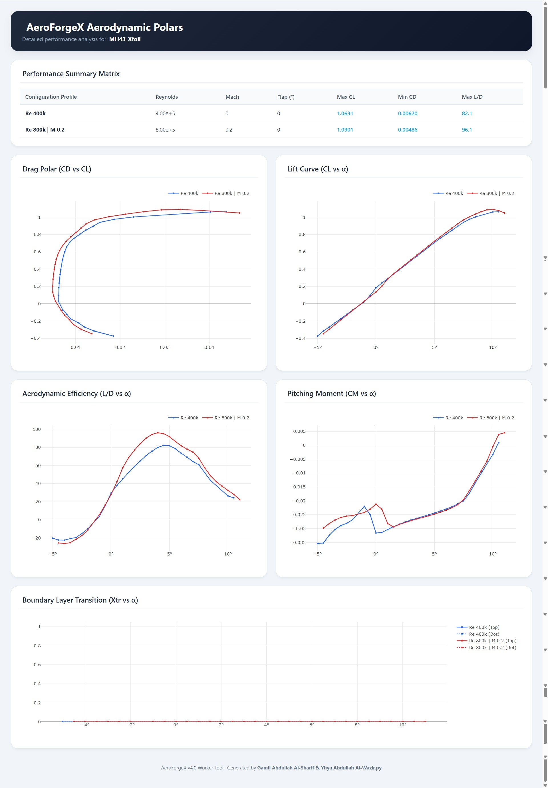
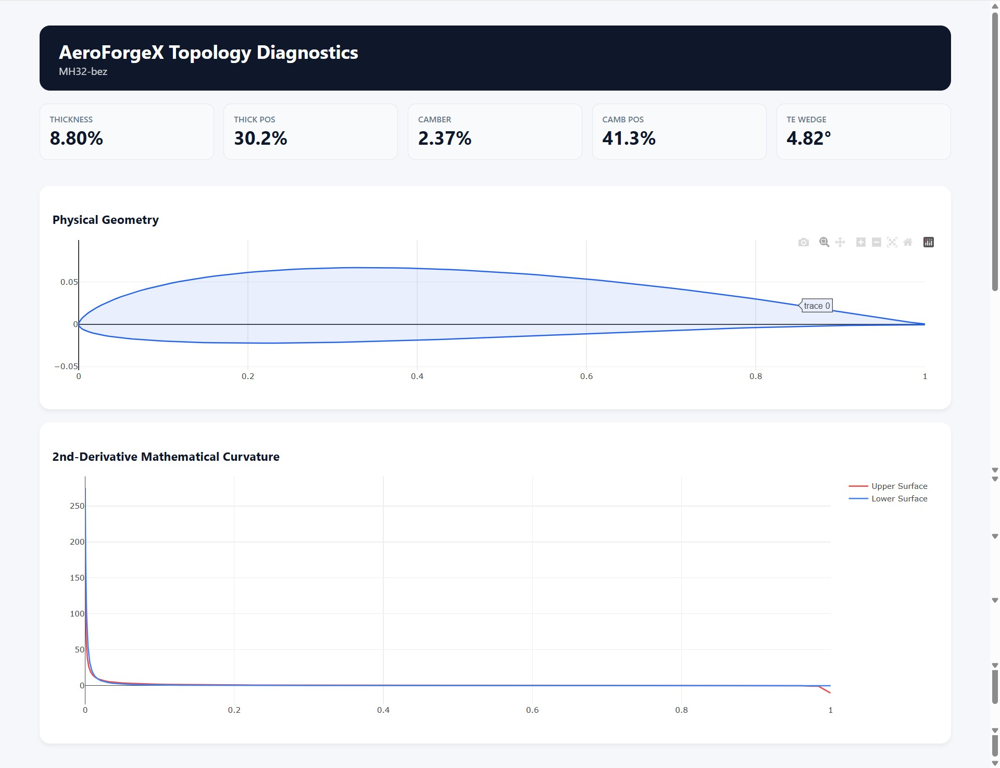
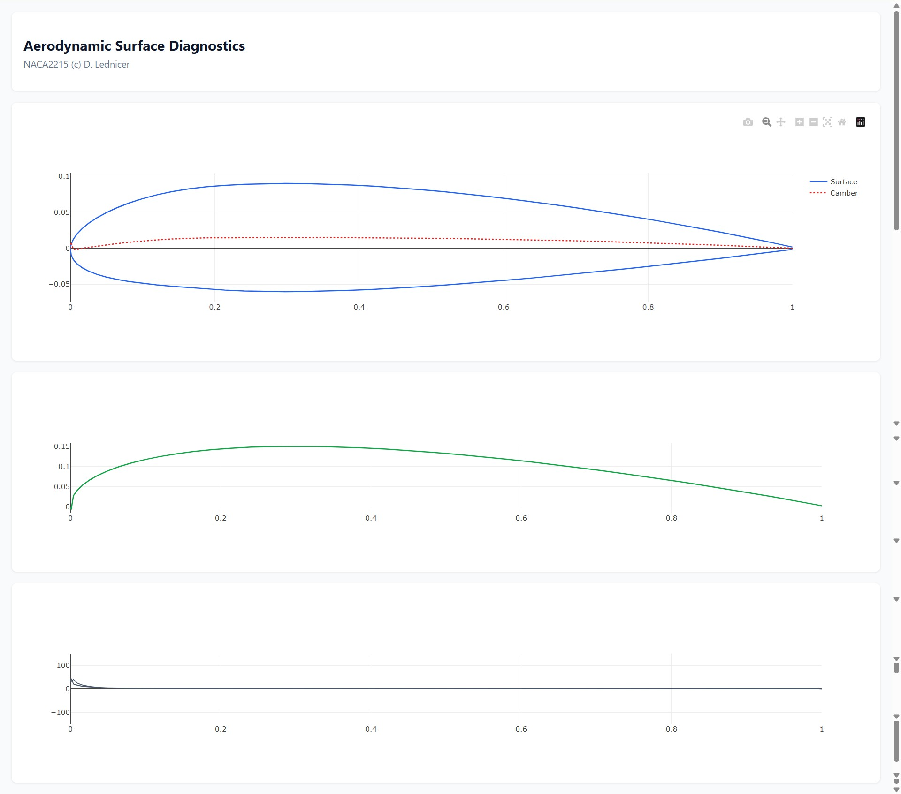

***

<link rel="stylesheet" href="https://cdnjs.cloudflare.com/ajax/libs/font-awesome/6.4.0/css/all.min.css">

## <i class="fa-solid fa-display"></i> SECTION 10: Worker Mode Outputs & Dashboards

<!-- FLEXBOX BADGES (Perfectly Spaced & Formatted) -->

  
  
  
  

### <i class="fa-solid fa-gears"></i> 10.1 The Philosophy of Deterministic Output

While the PyMoo Memetic Optimizer generates massive generational ledgers tracking the AI's evolving learning curve, **Worker Mode** (invoked via the `-w` CLI flag or Tab 3 in the GUI) operates on a completely different paradigm. 

  <h4 style="margin-top: 0px; margin-bottom: 8px; color: #065F46;"><i class="fa-solid fa-bolt"></i> Instant & Actionable</h4>
  
Worker Mode is fully deterministic. It executes instant, high-precision mathematical and aerodynamic commands. Therefore, its outputs are designed for <strong>immediate integration into external engineering workflows</strong>—whether that is exporting 3D lofting stations to SolidWorks, importing drag polars into XFLR5, or printing diagnostic PDFs for academic research.

---

### <i class="fa-solid fa-folder-tree"></i> 10.2 The Sandbox & Batch File Architecture

When executing rapid geometric manipulations, accidentally overwriting your raw, original airfoil databases is a critical risk. AeroForgeX v4.0 introduces a strictly organized, automated directory structure to safely isolate your Worker outputs.

  <!-- GUI Sandbox Card -->
  

    <h4 style="margin-top: 0px; margin-bottom: 10px; color: #475569;"><i class="fa-solid fa-desktop" style="color: #3B82F6;"></i> 10.2.1 GUI Execution (<code>Outputs/Worker_Mode/</code>)</h4>
    
If you use the Streamlit Web Ecosystem (Tab 3), AeroForgeX automatically routes all outputs to a centralized sandbox.

    

      Outputs/Worker_Mode/[Directive]/[Airfoil_Name]/
    

    
<em>Example:</em> Deflecting a NACA0012 flap deposits to: <code>Outputs/Worker_Mode/Flap/NACA0012/NACA0012_flap.dat</code>

  

  <!-- CLI Batch Card -->
  

    <h4 style="margin-top: 0px; margin-bottom: 10px; color: #475569;"><i class="fa-solid fa-server" style="color: #10B981;"></i> 10.2.2 CLI Batch Interceptor (<code>Worker_Batch_Output/</code>)</h4>
    
If you use the CLI to run a massive batch process on an entire directory (e.g., <code>-w norm -a Airfoils/Raw/</code>), AeroForgeX intercepts the command to protect your raw files.

    <ul style="margin-bottom: 0px; padding-left: 20px; font-size: 0.9em; color: #555; line-height: 1.6;">
      <li>It automatically generates a <code>Worker_Batch_Output/</code> subfolder <em>directly inside</em> your target directory.</li>
      <li>All 300 processed files are deposited cleanly inside this folder, ensuring the original database remains untouched.</li>
    </ul>
  

---

### <i class="fa-solid fa-chart-area"></i> 10.3 The Aerodynamic Polar Dashboards (<code>polar-csv</code>)

When executing an automated flight envelope sweep (cross-multiplying $Mach \times Reynolds \times Flaps$), AeroForgeX generates a massive performance matrix. The `polar-csv` directive outputs two critical files:

  
  <h4 style="margin-top: 0px; margin-bottom: 8px; color: #1E3A8A;"><i class="fa-solid fa-table" style="color: #3B82F6;"></i> 1. The Data Science Ledger (<code>master_polar.csv</code>)</h4>
  
Instead of dozens of fragmented text files, this appends all data across all flight regimes into a single, massive, semicolon-delimited CSV. <strong>Use-Case:</strong> The absolute gold standard for Data Science. Open this in Excel to generate Pivot Tables, or use Python Pandas to train aerodynamic Machine Learning models.

  <h4 style="margin-top: 0px; margin-bottom: 12px; color: #1E3A8A;"><i class="fa-solid fa-chart-line" style="color: #10B981;"></i> 2. The Interactive HTML Polar Dashboard</h4>
  
AeroForgeX writes a standalone, offline Plotly.js HTML file (rendered automatically in GUI Tab 4). It presents five critical interactive graphs:

  

  <ul style="margin-bottom: 0px; padding-left: 0px; list-style-type: none; font-size: 0.95em; color: #444; line-height: 1.7;">
    <li style="margin-bottom: 10px;"><strong style="color: #D97706;"><i class="fa-solid fa-water"></i> Graph 1: The Drag Polar ($C_D$ vs $C_L$)</strong> 
    The defining fingerprint. Look for the <strong>"Drag Bucket."</strong> On advanced laminar airfoils, the curve features a distinct vertical "dip" of exceptionally low drag. Your aircraft's design cruise $C_L$ must sit perfectly inside this bucket for maximum fuel efficiency.</li> <li style="margin-bottom: 10px;"><strong style="color: #D97706;"><i class="fa-solid fa-plane-arrival"></i> Graph 2: The Lift Curve ($C_L$ vs $\alpha$)</strong> 
    Observe the top right where the line crests—this is your <strong>Stall Angle ($C_{L_{max}}$)</strong>. A sharp, vertical cliff indicates a dangerous Leading-Edge Stall. A gentle rounding indicates a benign Trailing-Edge Stall.</li> <li style="margin-bottom: 10px;"><strong style="color: #D97706;"><i class="fa-solid fa-paper-plane"></i> Graph 3: Aerodynamic Efficiency ($L/D$ vs $\alpha$)</strong> 
    The absolute peak dictates maximum wing efficiency. For gliders or endurance UAVs, this exact angle is your target pitch for maximizing flight time.</li>  <li style="margin-bottom: 10px;"><strong style="color: #D97706;"><i class="fa-solid fa-rotate-left"></i> Graph 4: Pitching Moment ($C_M$ vs $\alpha$)</strong> 
    A highly negative $C_M$ implies a strong nose-down moment. Massive lift wings often generate massive negative $C_M$, requiring a large tailplane downforce, which induces massive "Trim Drag" that negates the wing's benefits.</li>  <li><strong style="color: #D97706;"><i class="fa-solid fa-wind"></i> Graph 5: Boundary Layer Transition ($X_{tr}$ vs $\alpha$)</strong> 
    The holy grail of low-speed aerodynamics. If the line stays near $0.6$ or $0.7$ (60-70% chord) even at high angles, you have achieved a highly advanced Laminar Flow airfoil. If it drops to $0.1$ immediately, it is fully turbulent.</li>
  </ul>

---

### <i class="fa-solid fa-stethoscope"></i> 10.4 Topological Diagnostics Reports (<code>report</code>)

Before optimizing, an airfoil must be mathematically sanitized. The `report` tool acts as the "Surgeon's Table", generating both an interactive HTML dashboard and a printable PDF document (`[Prefix]_diagnostics.pdf`).

  

  

  
  <h4 style="margin-top: 0px; margin-bottom: 8px; color: #475569;"><i class="fa-solid fa-ruler-combined" style="color: #3B82F6;"></i> 1. The Physical Geometry & Camber Plot</h4>
  
Displays a synchronized, 1:1 scaled plot of the coordinates overlaid with the mathematical Camber Line. Useful for macro-shape checks, but the human eye cannot detect the microscopic errors that crash CFD solvers.

  <h4 style="margin-top: 0px; margin-bottom: 10px; color: #475569;"><i class="fa-solid fa-wave-square" style="color: #10B981;"></i> 2. The 2nd-Derivative Curvature Spectrum ($k$)</h4>
  
The most critical diagnostic tool. The engine converts coordinates into a continuous B-Spline and plots the mathematical curvature ($k$) across the chord: 
  $k = \frac{x'y'' - y'x''}{(x'^2 + y'^2)^{3/2}}$

  <ul style="margin-bottom: 0px; padding-left: 20px; font-size: 0.95em; color: #444; line-height: 1.7;">
    <li><strong style="color: #1E3A8A;">The Leading Edge Peak:</strong> Curvature should spike massively at $X=0$ and drop smoothly. A "split spike" means a faceted, blunt nose that triggers immediate turbulent transition.</li>
    <li><strong style="color: #DC2626;">Macro-Reversals (Zero-Crossing):</strong> If curvature crosses the $Y=0$ axis (convex to concave), it causes a severe adverse pressure gradient. The boundary layer separates, forming a drag-inducing separation bubble. <em>(Curvature should never cross zero until the trailing edge, unless designing reflexed flying wings).</em></li>
    <li><strong style="color: #EA580C;">Micro-Spikes (The Sawtooth):</strong> If the line looks like a jagged EKG monitor, the mesh is corrupted by numerical noise. The panel method <strong>will fail</strong>. You must run <code>-w bezier</code> or <code>-w smooth</code> to sanitize it.</li>
  </ul>

---

### <i class="fa-solid fa-cubes"></i> 10.5 Geometric Morphing Outputs (<code>set</code>, <code>blend</code>, <code>flap</code>)

When executing direct geometric transformations, Worker Mode outputs clean, instantly usable coordinate files to your sandbox.

  <!-- .dat Card -->
  

    <h4 style="margin-top: 0px; margin-bottom: 8px; color: #475569;"><i class="fa-solid fa-file-code" style="color: #3B82F6;"></i> The <code>.dat</code> Output</h4>
    
Formatted in the strict Selig Standard (Upper Trailing Edge $\rightarrow$ Leading Edge $\rightarrow$ Lower Trailing Edge). These are mathematically verified and ready for immediate CAD lofting in SolidWorks/CATIA.

  

  <!-- Family Card -->
  

    <h4 style="margin-top: 0px; margin-bottom: 8px; color: #475569;"><i class="fa-solid fa-folder-tree" style="color: #10B981;"></i> The Parametric Family Folder (<code>_Family/</code>)</h4>
    
If you use the <code>-w generate</code> command (e.g., <code>t=10:20:5</code>), AeroForgeX automatically creates a dedicated <code>[Prefix]_Family/</code> sub-directory. It populates it with all incrementally scaled airfoils (e.g., 10%, 12.5%, 15%...). This keeps your workspace perfectly organized when preparing massive 3D wing lofts.

  

  <!-- .bez Card -->
  

    <h4 style="margin-top: 0px; margin-bottom: 8px; color: #475569;"><i class="fa-solid fa-bezier-curve" style="color: #F59E0B;"></i> The <code>.bez</code> Mathematical Blueprints</h4>
    
If you use the <code>-w bezier</code> "Shrink-Wrap" tool to repair a corrupted airfoil, AeroForgeX outputs the physical <code>.dat</code> file <em>and</em> a <code>.bez</code> file. This contains the exact mathematical control points discovered by the Nelder-Mead Simplex, allowing you to load it back into AeroForgeX later without losing floating-point precision!

  

