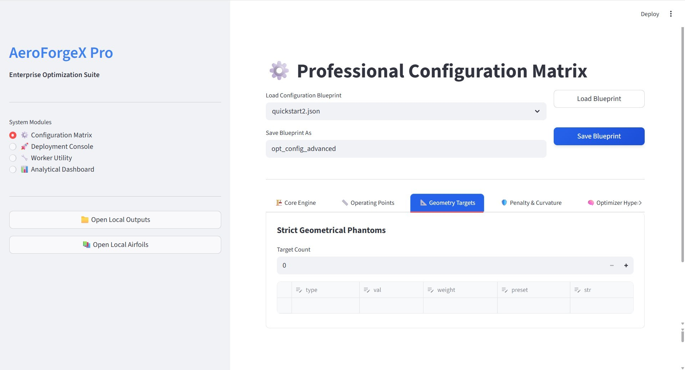
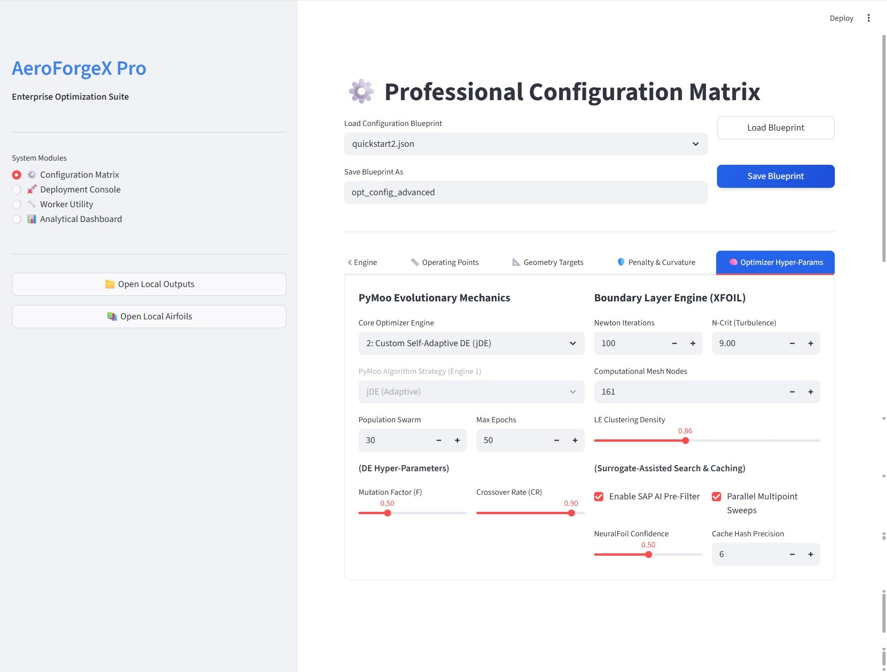
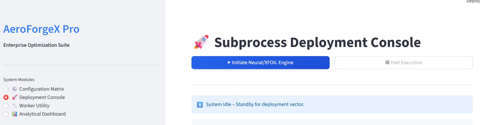
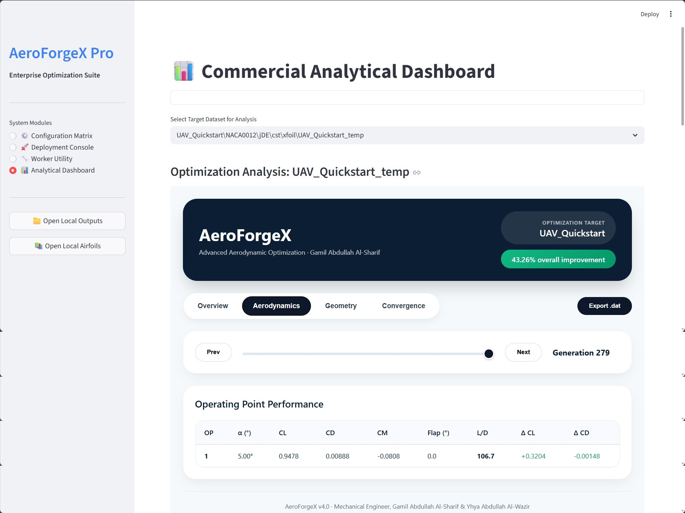
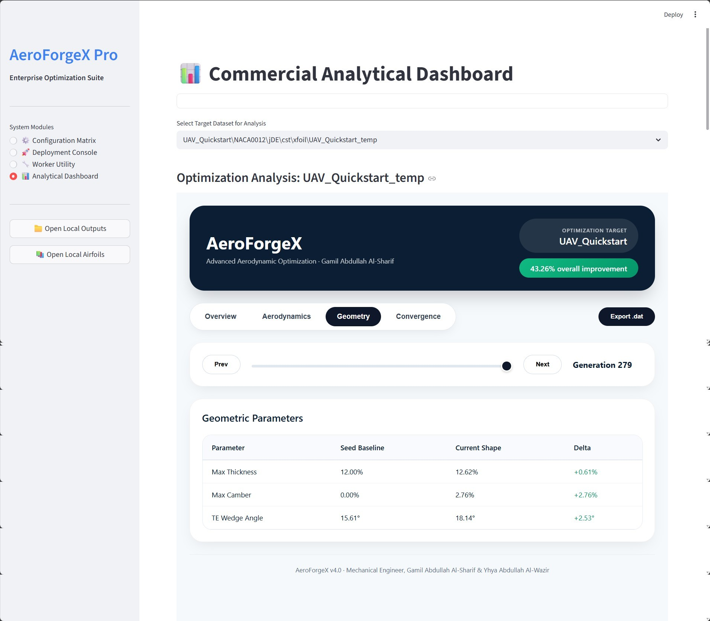
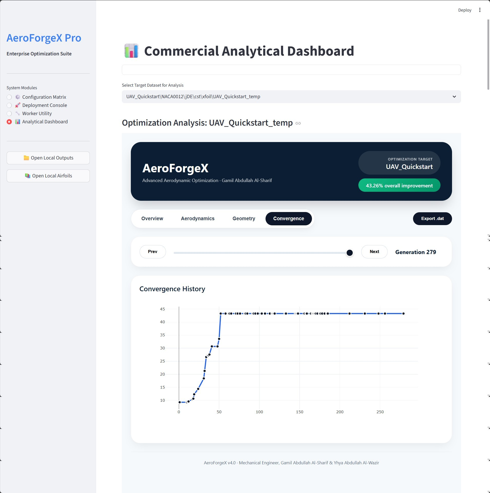
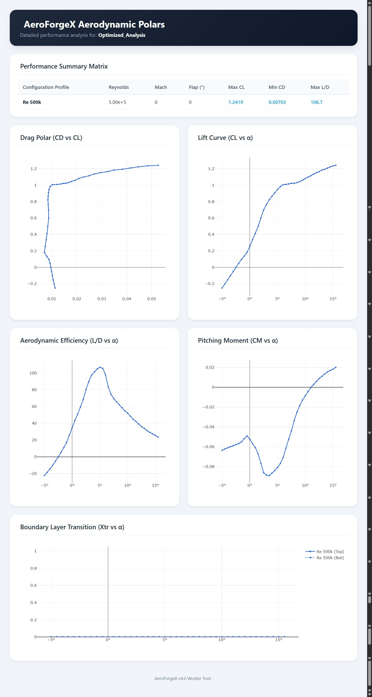

***

<link rel="stylesheet" href="https://cdnjs.cloudflare.com/ajax/libs/font-awesome/6.4.0/css/all.min.css">

# <span style="color: #00BFFF;"><i class="fa-solid fa-book-journal-whills"></i> SECTION 2: Installation & The "Hello World" Quick Start Guide</span>

<div style="background-color: #f8f9fa; border-left: 4px solid #708090; padding: 15px; border-radius: 4px; color: #444; margin-bottom: 20px; font-style: italic;">
  <strong><i class="fa-solid fa-circle-info" style="color: #1E90FF;"></i> Engineering Note:</strong> This section is not merely a list of commands to copy and paste. It is a comprehensive, guided technical tutorial. It takes you step-by-step through environment setup, a real-world aerospace design scenario, execution via both the <strong>Web GUI</strong> and the <strong>Headless CLI</strong>, and provides a line-by-line interpretation of the fluid-dynamic data outputs.
</div>

---

## <span style="color: #4682B4;"><i class="fa-solid fa-download"></i> 2.1 Initialization & Environment Setup</span>

AeroForgeX v4.0 is a Python-based ecosystem, but it relies heavily on external C-compiled math libraries and Fortran binaries. A strict environment setup is required to prevent execution faults.

### <span style="color: #2E8B57;"><i class="fa-solid fa-folder-tree"></i> Step 1: Cloning the Repository</span>
Download or clone the AeroForgeX directory to your local workstation.
> ⚠️ **Hardware Recommendation:** We highly recommend placing the folder on an **NVMe Solid State Drive (SSD)** or a **RAM Disk**. The XFOIL subprocess writes tens of thousands of temporary files during an optimization run. Mechanical Hard Drives (HDDs) will severely bottleneck the optimizer.

### <span style="color: #2E8B57;"><i class="fa-solid fa-microchip"></i> Step 2: Positioning the XFOIL Fortran Binary</span>
AeroForgeX does not compile XFOIL from scratch; it acts as an asynchronous subprocess wrapper.
1. Download the pre-compiled `xfoil.exe` (Windows) or `xfoil` binary (Linux/macOS) from the official MIT aerodynamics repository.
2. Place the executable **directly into the `AeroForgeX_scr` folder** *(in the exact same folder as `aeroforgex_cli.py`)*.

---

## <span style="color: #4682B4;"><i class="fa-brands fa-python"></i> 2.2 Modular Dependency Installation Strategy</span>

AeroForgeX v4.0 is highly modular. To prevent environment bloat, the software allows you to install dependencies in **"Tiers"** based entirely on your intended workflow. Choose the installation tier that matches your engineering needs.

<div style="display: flex; flex-direction: column; gap: 15px; margin-top: 15px; margin-bottom: 20px;">

<!-- TIER 1 -->
<div style="background-color: #F0F8FF; border-left: 5px solid #4682B4; padding: 15px; border-radius: 6px; color: #333;">
  <h4 style="margin-top: 0px; margin-bottom: 8px; color: #27408B;"><i class="fa-solid fa-terminal"></i> Tier 1: The Core Foundation (CLI + XFOIL Only)</h4>
  <p style="margin-bottom: 8px; font-size: 0.95em;"><em>Recommended for: Headless Linux HPC clusters, automated bash-scripting, and traditional aerodynamicists who only trust Navier-Stokes/Panel-Method physics.</em></p>
  <p style="margin-bottom: 8px; font-size: 0.95em;">This tier provides the absolute minimum packages required to run the <code>aeroforgex_cli.py</code> Master Orchestrator, the Numba C-speed calculus engine, the PyMoo AI, and generate standalone HTML/PDF reports.</p>
  <code style="display: block; background-color: #1E1E1E; color: #D4D4D4; padding: 10px; border-radius: 4px; margin-bottom: 10px;">pip install numpy scipy numba pymoo pandas matplotlib plotly colorama tqdm psutil</code>
  <ul style="margin-bottom: 0px; font-size: 0.9em; color: #555;">
    <li><strong>numba:</strong> Critical. Compiles the Python geometric splines into C-machine code.</li>
    <li><strong>pymoo:</strong> Powers the Memetic Evolutionary algorithms.</li>
    <li><strong>psutil:</strong> Manages OS-level thread priorities and limits XFOIL memory bleeding.</li>
    <li><strong>pandas & plotly:</strong> Required by the CLI to write <code>.csv</code> ledgers and generate the offline HTML Convergence & Polar Dashboards.</li>
  </ul>
</div>

<!-- TIER 2 -->
<div style="background-color: #FFF3E0; border-left: 5px solid #FF8C00; padding: 15px; border-radius: 6px; color: #333;">
  <h4 style="margin-top: 0px; margin-bottom: 8px; color: #E65100;"><i class="fa-solid fa-brain"></i> Tier 2: The Deep Learning Upgrade (+ NeuralFoil)</h4>
  <p style="margin-bottom: 8px; font-size: 0.95em;"><em>Recommended for: Massive multi-point optimization sweeps, Kinematic Flap co-optimization, and rapid concept exploration where XFOIL is too slow.</em></p>
  <p style="margin-bottom: 8px; font-size: 0.95em;">To bypass the Fortran engine and use the lightning-fast CNN surrogate, you must install the <code>neuralfoil</code> library. (Ensure Tier 1 is installed first).</p>
  <code style="display: block; background-color: #1E1E1E; color: #D4D4D4; padding: 10px; border-radius: 4px; margin-bottom: 10px;">pip install neuralfoil</code>
  <div style="background-color: #FFEBEE; border: 1px solid #EF5350; padding: 8px; border-radius: 4px; color: #C62828; font-size: 0.85em;">
    <strong>⚠️ ENGINEERING NOTE (The Tensor Backend):</strong> <code>neuralfoil</code> maybe requires a heavy machine-learning backend to process its tensors. Installing via pip will usually auto-install requirements. Be aware this will  increase the size of your virtual environment.
  </div>
</div>

<!-- TIER 3 -->
<div style="background-color: #FFF0F2; border-left: 5px solid #FF4B4B; padding: 15px; border-radius: 6px; color: #333;">
  <h4 style="margin-top: 0px; margin-bottom: 8px; color: #B22222;"><i class="fa-brands fa-chrome"></i> Tier 3: The Full Pro Web Ecosystem (+ GUI)</h4>
  <p style="margin-bottom: 8px; font-size: 0.95em;"><em>Recommended for: Commercial engineers, daily desktop use, and visual rapid prototyping.</em></p>
  <p style="margin-bottom: 8px; font-size: 0.95em;">If you want to abandon the command line entirely and use the beautiful, 4-tab interactive AeroForgeX Pro Web Dashboard, you must install the Streamlit framework. (Ensure Tier 1 is installed first).</p>
  <code style="display: block; background-color: #1E1E1E; color: #D4D4D4; padding: 10px; border-radius: 4px; margin-bottom: 10px;">pip install streamlit streamlit-autorefresh</code>
  <ul style="margin-bottom: 0px; font-size: 0.9em; color: #555;">
    <li><strong>streamlit:</strong> The core web framework that renders the UI natively in your browser.</li>
    <li><strong>streamlit-autorefresh:</strong> A critical background component allowing the Deployment Console to continuously poll live Fortran telemetry logs without manual web-page refreshes.</li>
  </ul>
</div>

</div>

### <span style="color: #32CD32;"><i class="fa-solid fa-box-archive"></i> 📦 The "All-In-One" Master `requirements.txt`</span>
If you are setting up a high-end desktop workstation and want access to *every* feature AeroForgeX offers, create a `requirements.txt` file in your root directory and paste the following heavily annotated blueprint. Then simply execute `pip install -r requirements.txt`.

```text
# ==============================================================================
# AeroForgeX v4.0 Pro - Master Dependencies
# Python 3.9+ Recommended
# ==============================================================================

# --- 1. CORE MATHEMATICS & JIT COMPILATION (Mandatory) ---
numpy>=1.21.0
scipy>=1.7.0
numba>=0.56.0

# --- 2. MEMETIC OPTIMIZATION ENGINE (Mandatory) ---
pymoo>=0.6.0.1

# --- 3. DATA HANDLING, LOGGING, & OS MANAGEMENT (Mandatory) ---
pandas>=1.3.0
colorama>=0.4.5
tqdm>=4.64.0
psutil>=5.9.0

# --- 4. VISUALIZATION & REPORTING (Mandatory for HTML/PDF outputs) ---
matplotlib>=3.5.0
plotly>=5.10.0

# ==============================================================================
# OPTIONAL MODULES (Comment out if not required)
# ==============================================================================

# --- 5. THE WEB ECOSYSTEM (Required for AeroForgeX_GUI.py) ---
streamlit>=1.20.0
streamlit-autorefresh>=1.0.0

# --- 6. DEEP LEARNING SURROGATE (Required for "solver": "neuralfoil") ---

neuralfoil>=0.3.1
```

---

## <span style="color: #4682B4;"><i class="fa-solid fa-crosshairs"></i> 2.3 The Scenario: UAV Cruise Optimization</span>

In software development, "Hello World" is the simplest program to prove the system works. In computational aerodynamics, our "Hello World" is taking a symmetric, unoptimized airfoil and autonomously morphing it into a high-efficiency lifting surface.

<div style="background-color: #1E293B; border-left: 5px solid #3B82F6; padding: 20px; border-radius: 6px; color: #F8FAFC; margin-bottom: 20px;">
  <h3 style="margin-top: 0px; color: #60A5FA;"><i class="fa-solid fa-clipboard-check"></i> The Mission Brief</h3>
  You are designing a medium-altitude Unmanned Aerial Vehicle (UAV).
  <ul style="margin-bottom: 0px; line-height: 1.6;">
    <li><i class="fa-solid fa-seedling" style="color: #34D399;"></i> <strong>Baseline Seed Airfoil:</strong> The classic NACA 0012 (A symmetrical, 12% thick airfoil).</li>
    <li><i class="fa-solid fa-wind" style="color: #93C5FD;"></i> <strong>Flight Condition:</strong> Cruise at a Reynolds Number ($Re$) of $500,000$.</li>
    <li><i class="fa-solid fa-arrow-trend-up" style="color: #FBBF24;"></i> <strong>Aerodynamic Objective:</strong> Maximize the Lift-to-Drag ratio ($L/D$, or "Glide Ratio") at exactly $\alpha = 5.0^\circ$.</li>
    <li><i class="fa-solid fa-dumbbell" style="color: #F87171;"></i> <strong>Structural Constraints:</strong> The wing requires absolute structural rigidity for its primary carbon-fiber spar. Thickness must not drop below <strong>11%</strong>, and curvature must remain perfectly smooth to prevent flow separation.</li>
  </ul>
</div>

AeroForgeX v4.0 offers two distinct ways to solve this: **Method A (Web GUI)** and **Method B (Headless CLI)**. 

---

## <span style="color: #4682B4;"><i class="fa-brands fa-chrome"></i> 2.4 Method A: The Web Ecosystem (Visual Prototyping)</span>

*(Requires Tier 3 Dependencies)* The Web Dashboard powered by Streamlit allows you to visually configure complex matrices without writing JSON code. Recommended for daily engineering.

### <span style="color: #1E90FF; font-weight: bold;">Phase 1: Launching the Interface</span>
```bash
streamlit run AeroForgeX_GUI.py
```
*<i class="fa-solid fa-gear fa-spin" style="color: #808080;"></i> Under the hood:* The script hijacks the terminal, spins up a local web server, and opens your default browser to `http://localhost:8501`.

<p align="center">
  
</p>


### <span style="color: #1E90FF; font-weight: bold;">Phase 2: Configuring the Engineering Matrix</span>
On the left sidebar, navigate to the **⚙️ Configuration Matrix**. Set the tabs strictly as follows:

1. **🏗️ Core Engine:** 
   * Solver: **xfoil** | Parametrization: **cst** | Baseline Seed: `NACA0012.dat`
   * *Check:* The Live Seed Preview will plot the teardrop shape. Leave CST weights at **6 Top / 6 Bottom** (14 variables).
2. **📏 Operating Points:** 
   * Multipoint Count: **1** | Mode: **spec-al** | Val: **5.0** | Re: **500000** | Opt Type: **max-glide**

<p align="center">
  
</p>


  3. **📐 Geometry Targets:** Leave Target Count at **0**.
   
<p align="center">
  
</p>


4. **🛡️ Penalty & Curvature:** 
   * Set **Thickness Constraint** slider: **11.0% to 20.0%**.
   * Check **Auto-Calibrate Strict Flow Separation Curves**.   
<p align="center">
  
</p>

5. **🧠 Optimizer Hyper-Params:** 
   * Core Optimizer Engine: **2: Custom Self-Adaptive DE (jDE)** | Population Swarm: **30** | Max Epochs: **50**
<p align="center">
  
</p>


### <span style="color: #1E90FF; font-weight: bold;">Phase 3: Deploying the Swarm</span>
Go to the **🚀 Deployment Console** and click **▶ Initiate Neural/XFOIL Engine**. The terminal window will light up as isolated sandboxes are spawned across your CPU cores. Wait ~2 to 3 minutes.
<p align="center">
  
</p>

### <span style="color: #1E90FF; font-weight: bold;">Phase 4: Analyzing the Results</span>
Go to the **📊 Analytical Dashboard**, select your newly generated dataset, and view the **Interactive HTML Convergence Report**. Drag the slider to watch the AI visually hollow out the camber line and droop the trailing edge while perfectly preserving your 11% spar thickness!
<p align="center">
  
</p>
<p align="center">
  
</p>
<p align="center">
  
</p>
<p align="center">
  
</p>


---

## <span style="color: #4682B4;"><i class="fa-solid fa-terminal"></i> 2.5 Method B: The Command Line Interface (HPC Mode)</span>

*(Requires Tier 1 Dependencies)* For remote Linux supercomputers, AWS clouds, or automated `.bat` scripts, you must bypass the GUI and use the CLI.

### <span style="color: #1E90FF; font-weight: bold;">Phase 1: Crafting the JSON Matrix</span>
Create a file named `quickstart.json` in your `json_Input/` folder:

```json
{
  "opt_opts": {
    "solver": "xfoil", "shape_func": "cst", 
    "out_prefix": "UAV_Quickstart", "auto_output_dir": true, 
    "threads": -1, "verbose": true
  },
  "cst_opts": { "n_t": 6, "n_b": 6, "initial_perturb": 0.05 },
  "op_conds": {
    "num_pts": 1, "re_def": 500000.0, 
    "mode": ["spec-al"], "val": [5.0], "opt_type": ["max-glide"], "weight": [1.0]
  },
  "constr": { "chk_geo": true, "min_t": 0.11, "min_te_ang": 5.0 },
  "curv": { "chk_curv": true, "auto_curv": true },
  "optim_set": { "type": 2, "algo": "jde", "pop": 30, "gen": 50, "rescue": true }
}
```

### <span style="color: #1E90FF; font-weight: bold;">Phase 2: Validating the Configuration (Dry-Run)</span>
Before launching a massive run, always test your JSON for syntax errors:
```bash
python AeroForgeX_scr/aeroforgex_cli.py -w check-input -i json_Input/quickstart.json -a Airfoils/NACA0012.dat
```
<div style="background-color: #E8F5E9; border: 1px solid #4CAF50; padding: 10px; border-radius: 4px; color: #2E7D32; font-family: monospace; font-size: 0.9em; margin-top: 10px;">
  [ SYSTEM ] Processing Config: json_Input/quickstart.json<br>
  SYSTEM DIAGNOSTIC: Configuration Matrix parsed successfully without strict syntax faults.
</div>

### <span style="color: #1E90FF; font-weight: bold;">Phase 3: Launching the Optimizer</span>
Execute the Master Orchestrator, passing the JSON matrix (`-i`) and baseline seed (`-a`):
```bash
python AeroForgeX_scr/aeroforgex_cli.py -i json_Input/quickstart.json -a Airfoils/NACA0012.dat
```

---

## <span style="color: #4682B4;"><i class="fa-solid fa-code"></i> 2.6 Reading the Terminal Output (The Matrix UI)</span>

AeroForgeX uses a high-performance, color-coded terminal UI. Understanding this telemetry is critical.

**1. The Boot Sequence & Calibration:**
The system mathematically rotates the seed, packs coordinate points densely at the nose (NASA Arc-Cosine), runs an Inverse Least-Squares matrix to lock the initial CST weights, and normalizes the initial drag score to exactly `1.000`.

**2. The Victory Grid:**
Every time PyMoo discovers a better airfoil, it prints a grid:

```text
==================================================================================
[ OPTIMA ] NEW BASELINE DISCOVERED | Gen: xxxx | Feas: PASS | Obj: 0.815243 | Improv: +18.40%
==================================================================================
OP | MODE | ALPHA |   CL   |    CD    |   L/D   || OBJECTIVE  |  DELTA   | IMPROVEMENT | STAT 
------------------------------------------------------------------------------------------------
01 | ALFA |  5.00 | 0.985  | 0.01250  |  78.80  || MAX GLIDE  | +12.000  |   +18.4%    | PASS 
==================================================================================
```
*   <span style="color: #32CD32; font-weight: bold;">Feas: PASS</span> - A valid, buildable, legal wing profile.
*   <span style="color: #1E90FF; font-weight: bold;">Obj: 0.8152</span> - The lower the score, the better. Dropping from `1.000` to `0.8152` is excellent.


**3. Local Refinement & Termination:**
Once jDE finishes 50 generations, the software applies the **Nelder-Mead Simplex** mathematical polisher to squeeze out the final decimals of efficiency.

---

## <span style="color: #4682B4;"><i class="fa-solid fa-folder-open"></i> 2.7 Reviewing Your Engineering Data</span>

Navigate to `Outputs/UAV_Quickstart/NACA0012/jDE/cst/xfoil/`. You will find your finalized deliverables:

| <i class="fa-solid fa-file" style="color: #808080;"></i> File Element | <i class="fa-solid fa-magnifying-glass" style="color: #808080;"></i> Engineering Description |
| :--- | :--- |
| 📄 **`UAV_Quickstart.dat`** | The final $(X, Y)$ coordinate array, ready for SolidWorks or ANSYS. |
| 📄 **`...-norm.dat`** | The mathematically "sanitized" seed airfoil. **Use this as your baseline for CFD.** |
 |
| 📊 **`Design_OpPoints.csv`** | The Aerodynamic Master Ledger of every successful generation. |
| 📊 **`Design_Coords.csv`** | Backup ledger of all $(X,Y)$ arrays. Prevents data loss if power fails at Gen 49. |
| 🌐 **`...Report.html`** | The Crown Jewel. Offline Plotly Dashboard with generation sliders and curves. |

---

## <span style="color: #4682B4;"><i class="fa-solid fa-plane-circle-check"></i> 2.8 The Post-Flight Check: Worker Mode Basics</span>

How does the airfoil perform across its *entire* flight envelope, not just at $5.0^\circ$? We use the **Standalone Worker Utility (`-w`)** to bypass the AI and run a **Drag Polar Sweep**.

Create `sweep.json`:
```json
{
  "polar_generation": {
    "generate_polar": true, "polar_reynolds": [500000.0], "polar_mach": [0.0],
    "op_mode": "spec-al", "op_point_range": [-5.0, 15.0, 0.5]
  },
  "xfoil_opts": { "ncrit": 9.0, "iter": 200 }
}
```

Execute the `polar-csv` worker:
```bash
python AeroForgeX_scr/aeroforgex_cli.py -w polar-csv -i json_Input/sweep.json -a Outputs/UAV_Quickstart/NACA0012/jDE/cst/xfoil/UAV_Quickstart.dat -o Optimized_Analysis
```

<div style="background-color: #FFF3CD; border-left: 4px solid #FFC107; padding: 10px; border-radius: 4px; color: #856404; margin-top: 15px;">
  <strong><i class="fa-solid fa-chart-line"></i> The Result:</strong> Open the auto-generated HTML file in your output folder. Hover over the Plotly Drag Polar curve at exactly $C_L \approx 0.98$. You will physically see the <strong>"Drag Bucket"</strong> the AI carved out at your exact design point, proving irrefutably that the Memetic Optimization was a complete success!
</div>  

<p align="center">
  
</p>
 


***

<link rel="stylesheet" href="https://cdnjs.cloudflare.com/ajax/libs/font-awesome/6.4.0/css/all.min.css">

## <span style="color: #00BFFF;"><i class="fa-solid fa-sitemap"></i> 2.9 Workspace Architecture & Execution Workflows</span>

<!-- FLEXBOX BADGES (Perfectly Spaced & Formatted) -->
<div style="display: flex; gap: 12px; margin-top: 10px; margin-bottom: 25px; flex-wrap: wrap;">
  
  
  
  
</div>

<p style="font-size: 0.95em; line-height: 1.6; color: var(--fgColor-default, #333);">To master AeroForgeX v4.0 Pro, an engineer must first understand its foundational ecosystem. AeroForgeX is not a single script; it is a highly structured, modular environment designed to maintain a clean workspace, prevent data collision during High-Performance Computing (HPC) runs, and streamline daily aerodynamic operations.</p>

---

### <span style="color: #4682B4;"><i class="fa-solid fa-folder-tree"></i> 2.9.1 The Anatomy of the Workspace (Repository Architecture)</span>

Before launching an optimization run, familiarize yourself with the strict directory architecture required by the orchestrator. **Warning: Modifying or moving these core folders may cause critical I/O routing failures and crash the fluid dynamics solvers.**

<div style="background-color: #1E1E1E; padding: 15px; border-radius: 8px; border: 1px solid #333; margin-bottom: 20px; box-shadow: 0 4px 15px rgba(0,0,0,0.2);">
  <pre style="margin: 0px; background-color: #1E1E1E; color: #D4D4D4; border: none; font-family: 'Consolas', monospace; font-size: 0.85em; line-height: 1.4; white-space: pre-wrap;"><span style="color: #9CDCFE; font-weight: bold;">AeroForgeX/</span>
│
├── <span style="color: #9CDCFE;">AeroForgeX_scr/</span>                 <span style="color: #6A9955;"># Core Python Math & Logic Modules</span>
│   ├── <span style="color: #CE9178;">aeroforgex_cli.py</span>           <span style="color: #6A9955;"># Master CLI Orchestrator & UI Router</span>
│   ├── <span style="color: #CE9178;">aero_polars.py</span>              <span style="color: #6A9955;"># Worker Mode execution & Sweep Engine</span>
│   ├── <span style="color: #CE9178;">config_manager.py</span>           <span style="color: #6A9955;"># JSON/Namelist Parser & Constraint Sanitizer</span>
│   ├── <span style="color: #CE9178;">geom_builder.py</span>             <span style="color: #6A9955;"># Airfoil preparation, Shape Parameterizations</span>
│   ├── <span style="color: #CE9178;">geom_core.py</span>                <span style="color: #6A9955;"># Numba-accelerated splines & mesh clustering</span>
│   ├── <span style="color: #CE9178;">math_accelerator.py</span>         <span style="color: #6A9955;"># C-speed matrix solvers & calculus operations</span>
│   ├── <span style="color: #CE9178;">obj_evaluator.py</span>            <span style="color: #6A9955;"># Master Objective Function & Penalty Engine</span>
│   ├── <span style="color: #CE9178;">obj_utils.py</span>                <span style="color: #6A9955;"># CSV Exporters, Matplotlib graphing, File I/O</span>
│   ├── <span style="color: #CE9178;">opt_engine.py</span>               <span style="color: #6A9955;"># PyMoo Differential Evolution & Simplex</span>
│   ├── <span style="color: #CE9178;">opt_engine_jDE.py</span>           <span style="color: #6A9955;"># Self-Adaptive jDE Engine</span>
│   ├── <span style="color: #CE9178;">opt_engine_SHADE.py</span>         <span style="color: #6A9955;"># SHADE Evolutionary Engine</span>
│   ├── <span style="color: #CE9178;">opt_utils.py</span>                <span style="color: #6A9955;"># Local search algorithms (Nelder-Mead)</span>
│   ├── <span style="color: #CE9178;">report_generator.py</span>         <span style="color: #6A9955;"># Interactive HTML/PDF Dashboard Engine</span>
│   ├── <span style="color: #CE9178;">shape_functions_param.py</span>    <span style="color: #6A9955;"># CST/Bezier/Hicks-Henne mathematical mapping</span>
│   ├── <span style="color: #CE9178;">solver_neuralfoil.py</span>        <span style="color: #6A9955;"># Machine Learning Surrogate routing</span>
│   ├── <span style="color: #CE9178;">solver_router.py</span>            <span style="color: #6A9955;"># Traffic Controller (XFOIL vs. NeuralFoil)</span>
│   ├── <span style="color: #CE9178;">solver_xfoil.py</span>             <span style="color: #6A9955;"># Fortran subprocess execution & Regex parsing</span>
│   ├── <span style="color: #CE9178;">utils_logger.py</span>             <span style="color: #6A9955;"># Colorama-based ANSI terminal UI engine</span>
│   └── <span style="color: #4EC9B0; font-weight: bold;">xfoil.exe</span>                   <span style="color: #6A9955;"># The MIT Fortran aerodynamic binary</span>
│
├── <span style="color: #9CDCFE;">Airfoils/</span>                       <span style="color: #6A9955;"># Starting Seed Geometries (e.g., NACA0012.dat)</span>
├── <span style="color: #9CDCFE;">json_Input/</span>                     <span style="color: #6A9955;"># Configuration Matrices (Engineering blueprints)</span>
├── <span style="color: #9CDCFE;">Outputs/</span>                        <span style="color: #6A9955;"># Auto-generated sandbox folders for optimization</span>
│── <span style="color: #CE9178;">AeroForgeX_GUI.py</span>               <span style="color: #6A9955;"># Streamlit Web Ecosystem</span>
├── <span style="color: #DCDCAA;">Run_AeroForgeX.bat</span>              <span style="color: #6A9955;"># One-click execution for Input_template.json</span>
├── <span style="color: #DCDCAA;">Run_quickstart.bat</span>              <span style="color: #6A9955;"># One-click execution for the Hello World tutorial</span>
├── <span style="color: #C586C0;">Stop_AeroForgeX.bat</span>             <span style="color: #6A9955;"># Graceful OS-Level AI kill switch (preserves data)</span>
├── <span style="color: #CE9178;">run_control</span>                     <span style="color: #6A9955;"># Dynamic interrupt listener tracking file</span>
│
├── <span style="color: #CE9178;">test_aeroforgex_full.py</span>         <span style="color: #6A9955;"># Exhaustive Test Orchestrator (Validates Math/PyMoo)</span>
└── <span style="color: #CE9178;">test_aeroforgex_work.py</span>         <span style="color: #6A9955;"># Exhaustive Test Orchestrator for Worker Mode (-w)</span></pre>
</div>

#### <span style="color: #1E90FF; font-weight: bold;"><i class="fa-solid fa-magnifying-glass"></i> Deep Dive: Core Directories</span>
<div style="background-color: #F8F9FA; border: 1px solid #E2E8F0; padding: 15px; border-radius: 6px; margin-bottom: 25px;">
  <ul style="margin-bottom: 0px; padding-left: 20px; font-size: 0.95em; color: #444; line-height: 1.7;">
    <li><strong style="color: #2563EB;"><code>AeroForgeX_scr/</code></strong>: The "engine room." Contains all Python math engines, the AI orchestrators, the Master CLI, and the pre-compiled <code>xfoil.exe</code> binary. You rarely edit these unless modifying core physics.</li>
    <li><strong style="color: #2563EB;"><code>Airfoils/</code></strong>: Your local geometry database. Place your starting "Seed" geometries here. <strong>Strict Requirement:</strong> These must be standard Selig-formatted <code>.dat</code> coordinate files.</li>
    <li><strong style="color: #2563EB;"><code>json_Input/</code></strong>: The command deck. AeroForgeX reads <code>.json</code> matrices from here to understand your targets, flight envelopes, and structural constraints.</li>
    <li><strong style="color: #2563EB;"><code>Outputs/</code></strong>: The automated data repository. The system dynamically builds isolated, cryptographically secure sandbox directories here to completely prevent data corruption and file-lock collisions.</li>
    <li><strong style="color: #2563EB;"><code>test_aeroforgex_*</code></strong>: Auto-generated scripts used to validate your Python/Fortran environment. <em>Always run these after a fresh installation to verify Numba JIT compilation.</em></li>
  </ul>
</div>

---

### <span style="color: #4682B4;"><i class="fa-solid fa-gears"></i> 2.9.2 The Universal Batch Execution Workflow</span>

While AeroForgeX provides a highly robust CLI for automated bash scripting, typing long execution strings in a terminal can be tedious for daily tasks. Aerodynamicists need a **"zero-friction"** method to swap geometries, tweak flight conditions, and launch the AI instantly.

To achieve this, AeroForgeX ships with a pre-configured ecosystem utilizing two interconnected files: `Input_template.json` and `Run_AeroForgeX.bat`. This bypasses the command prompt entirely.

<div style="display: flex; flex-direction: column; gap: 15px; margin-top: 15px; margin-bottom: 25px;">

  <!-- Blueprint Card -->
  <div style="background-color: #F8F9FA; border: 1px solid #E2E8F0; padding: 15px; border-radius: 6px; border-left: 4px solid #3B82F6;">
    <h4 style="margin-top: 0px; margin-bottom: 10px; color: #1E3A8A;"><i class="fa-solid fa-file-code"></i> 2.9.2.1 The Master Blueprint: <code>Input_template.json</code></h4>
    <p style="margin-top: 0px; margin-bottom: 10px; font-size: 0.95em; color: #444; line-height: 1.6;">Located in <code>json_Input/</code>, this is the ultimate "superset" matrix, pre-loaded with every possible parameter and constraint the software supports. Instead of writing new JSON files from scratch, you use this as your permanent control deck for <strong>Seamless Parameter Swapping:</strong></p>
    <ul style="margin-bottom: 0px; padding-left: 20px; font-size: 0.9em; color: #555; line-height: 1.6;">
      <li><strong>Swapping Engines:</strong> Change <code>"aero_solver": "xfoil"</code> to <code>"neuralfoil"</code> to instantly evaluate geometry using the Deep Learning Surrogate.</li>
      <li><strong>Swapping Topology:</strong> Change <code>"shape_func": "cst"</code> to <code>"bezier"</code> to fundamentally alter how the AI mutates the surface.</li>
      <li><strong>Swapping Seeds:</strong> Redirect <code>"foil_file": "Airfoils/NACA0012.dat"</code> to any other <code>.dat</code> file to begin evolving a completely different wing.</li>
    </ul>
  </div>

  <!-- Array Truncation Card -->
  <div style="background-color: #F8F9FA; border: 1px solid #E2E8F0; padding: 15px; border-radius: 6px; border-left: 4px solid #10B981;">
    <h4 style="margin-top: 0px; margin-bottom: 10px; color: #065F46;"><i class="fa-solid fa-scissors"></i> 2.9.2.2 The Array Truncation Protocol (The 25-Point Rule)</h4>
    <p style="margin-top: 0px; margin-bottom: 8px; font-size: 0.95em; color: #444; line-height: 1.6;">The template comes pre-configured with massive arrays defining <strong>25 distinct flight conditions</strong>. However, you rarely need to optimize for 25 points simultaneously. AeroForgeX utilizes a brilliant workflow trick:</p>
    <p style="margin-top: 0px; margin-bottom: 0px; font-size: 0.95em; color: #444; line-height: 1.6;">The software strictly obeys the <code>"num_operating_points (num_pts)"</code> integer. If set to <code>3</code>, AeroForgeX reads points (1), (2), and (3), and <strong>safely ignores</strong> data for points 4 through 25 without throwing an error.</p>
  </div>

</div>

<div style="background-color: #FFFBEB; border: 1px solid #FCD34D; border-left: 5px solid #F59E0B; padding: 15px; border-radius: 6px; margin-bottom: 25px;">
  <h4 style="margin-top: 0px; margin-bottom: 8px; color: #92400E;"><i class="fa-solid fa-lightbulb"></i> WHY IS THIS REVOLUTIONARY?</h4>
  <p style="margin-top: 0px; margin-bottom: 0px; font-size: 0.95em; color: #78350F; line-height: 1.6;">You never have to delete or re-type complex arrays. You can leave your massive, 25-point Master Flight Envelope permanently saved. When you arrive at work, dial <code>"num_operating_points (num_pts)"</code> down to <code>1</code> to run a rapid 3-minute feasibility test. Once satisfied, simply dial the integer back up to <code>25</code>, double-click the <code>.bat</code> file, and leave for an overnight HPC run.</p>
</div>

---

### <span style="color: #4682B4;"><i class="fa-solid fa-desktop"></i> 2.9.3 The OS-Level Execution Wrapper (<code>Run_AeroForgeX.bat</code>)</span>

Once your `Input_template.json` is configured, you execute the optimization by double-clicking `Run_AeroForgeX.bat`. This is not a simple shortcut; it is a sophisticated OS-level execution wrapper designed to ensure environmental stability and trap fatal errors before they crash the terminal.

<div style="background-color: #F8F9FA; border: 1px solid #E2E8F0; padding: 18px; border-radius: 6px; margin-top: 15px; margin-bottom: 25px;">
  <p style="margin-top: 0px; margin-bottom: 12px; color: #475569; font-weight: bold;"><i class="fa-solid fa-microchip"></i> Inside the <code>.bat</code> Architecture:</p>
  <ol style="margin-bottom: 0px; padding-left: 20px; font-size: 0.95em; color: #444; line-height: 1.7;">
    <li style="margin-bottom: 8px;"><strong>Directory Anchoring:</strong> The script executes <code>cd /d "%~dp0"</code> to forcefully lock the Current Working Directory (CWD). This ensures AeroForgeX never loses track of the <code>Airfoils/</code> or <code>Outputs/</code> paths, regardless of how it is launched.</li>
    <li style="margin-bottom: 8px;"><strong>Python Runtime Verification:</strong> It queries the OS System PATH (<code>python --version >nul</code>) to guarantee Python 3 is installed. If missing, it catches the <code>%errorlevel%</code>, prints a <code>[ FATAL ]</code> warning, and pauses the screen so the user can read the error rather than the window instantly flashing shut.</li>
    <li style="margin-bottom: 8px;"><strong>The Master Invocation:</strong> It automatically invokes the CLI, passing the exact relative path: <br>
      <code style="background-color: #1E1E1E; color: #D4D4D4; padding: 2px 6px; border-radius: 4px; border: 1px solid #333;">python AeroForgeX_scr\aeroforgex_cli.py -i json_Input/Input_template.json</code>
    </li>
    <li><strong>Graceful Termination Catchers:</strong> When the PyMoo algorithm concludes (or is safely killed), the script evaluates the final exit code, prints a PASS/FATAL status, and pauses the terminal so you can review the final metrics.</li>
  </ol>
</div>

---

### <span style="color: #4682B4;"><i class="fa-solid fa-power-off"></i> 2.9.4 Safely Stopping a Run (The OS-Level Kill Switch)</span>

Optimization runs with 10+ operating points and massive populations can take multiple hours. If you decide that a 15% improvement at Generation 150 is "good enough" and you want to stop the run early to extract the coordinates, **DO NOT press `Ctrl+C` or close the terminal window.**

<div style="background-color: #FEF2F2; border: 1px solid #FECACA; border-left: 5px solid #EF4444; padding: 15px; border-radius: 6px; margin-top: 15px; margin-bottom: 15px;">
  <h4 style="margin-top: 0px; margin-bottom: 8px; color: #991B1B;"><i class="fa-solid fa-skull-crossbones"></i> ⚠️ THE ZOMBIE PROCESS TRAP</h4>
  <p style="margin-top: 0px; margin-bottom: 0px; font-size: 0.95em; color: #7F1D1D; line-height: 1.6;">Killing the Python process violently via <code>Ctrl+C</code> will instantly corrupt the CSV tracking matrices. Worse, it will leave hidden <code>xfoil.exe</code> "zombie" processes permanently running in your computer's RAM. These orphaned Fortran binaries will max out your CPU in the background, requiring a full system reboot to clear.</p>
</div>

<div style="background-color: #F8F9FA; border: 1px solid #E2E8F0; padding: 15px; border-radius: 6px; margin-bottom: 25px;">
  <p style="margin-top: 0px; margin-bottom: 10px; font-size: 0.95em; color: #444; line-height: 1.6;">Instead, AeroForgeX features a graceful OS-level Kill Switch:</p>
  <ol style="margin-bottom: 12px; padding-left: 20px; font-size: 0.95em; color: #444; line-height: 1.6;">
    <li>Open the root folder of AeroForgeX in your file explorer.</li>
    <li>Locate and double-click the <strong><code>Stop_AeroForgeX.bat</code></strong> file.</li>
    <li>This script instantly injects the word <code>STOP</code> into the <code>run_control</code> tracking file (You can do it manually also: 1) Open run_control in Notepad 2) Delete all text inside, type the word stop, and save the file.).</li>
  </ol>
  <p style="margin-top: 0px; margin-bottom: 0px; font-size: 0.9em; color: #065F46; font-style: italic;"><i class="fa-solid fa-check"></i> <strong>What happens next?</strong> At the end of the current generation, the PyMoo <code>ProgressCallback</code> engine detects the stop command. It gracefully terminates the multi-core CPU pool, compiles final CSV/PNG reports, saves your <code>.dat</code> geometries, and exits safely, leaving your environment clean.</p>
</div>

---

### <span style="color: #4682B4;"><i class="fa-solid fa-list-check"></i> 2.9.5 Summary: The Standard Daily Workflow</span>

By combining the JSON superset and the OS-level wrappers, your daily engineering workflow is reduced to three frictionless steps:

<div style="display: flex; flex-direction: column; gap: 15px; margin-top: 15px; margin-bottom: 25px;">

  <!-- Step 1 -->
  <div style="background-color: #F8F9FA; border: 1px solid #E2E8F0; padding: 15px; border-radius: 6px; display: flex; align-items: center; gap: 15px;">
    <div style="background-color: #3B82F6; color: white; width: 40px; height: 40px; border-radius: 50%; display: flex; justify-content: center; align-items: center; font-weight: bold; font-size: 1.2em; flex-shrink: 0;">1</div>
    <div>
      <h4 style="margin-top: 0px; margin-bottom: 5px; color: #1E3A8A;">Edit</h4>
      <p style="margin-top: 0px; margin-bottom: 0px; font-size: 0.9em; color: #444;">Open <code>json_Input/Input_template.json</code> in a text editor (like VS Code or Notepad++). Adjust your target constraints and save the file (<code>Ctrl+S</code>).</p>
    </div>
  </div>

  <!-- Step 2 -->
  <div style="background-color: #F8F9FA; border: 1px solid #E2E8F0; padding: 15px; border-radius: 6px; display: flex; align-items: center; gap: 15px;">
    <div style="background-color: #10B981; color: white; width: 40px; height: 40px; border-radius: 50%; display: flex; justify-content: center; align-items: center; font-weight: bold; font-size: 1.2em; flex-shrink: 0;">2</div>
    <div>
      <h4 style="margin-top: 0px; margin-bottom: 5px; color: #065F46;">Execute</h4>
      <p style="margin-top: 0px; margin-bottom: 0px; font-size: 0.9em; color: #444;">Navigate to the AeroForgeX root folder and double-click <code>Run_AeroForgeX.bat</code> to launch the terminal UI and instantiate the Memetic AI.</p>
    </div>
  </div>

  <!-- Step 3 -->
  <div style="background-color: #F8F9FA; border: 1px solid #E2E8F0; padding: 15px; border-radius: 6px; display: flex; align-items: center; gap: 15px;">
    <div style="background-color: #F59E0B; color: white; width: 40px; height: 40px; border-radius: 50%; display: flex; justify-content: center; align-items: center; font-weight: bold; font-size: 1.2em; flex-shrink: 0;">3</div>
    <div>
      <h4 style="margin-top: 0px; margin-bottom: 5px; color: #92400E;">Review</h4>
      <p style="margin-top: 0px; margin-bottom: 0px; font-size: 0.9em; color: #444;">Once the run completes, navigate to your <code>Outputs/</code> folder to retrieve your finalized <code>.dat</code> coordinates, CSV aerodynamic ledgers, and Interactive HTML Dashboards.</p>
    </div>
  </div>

</div>
