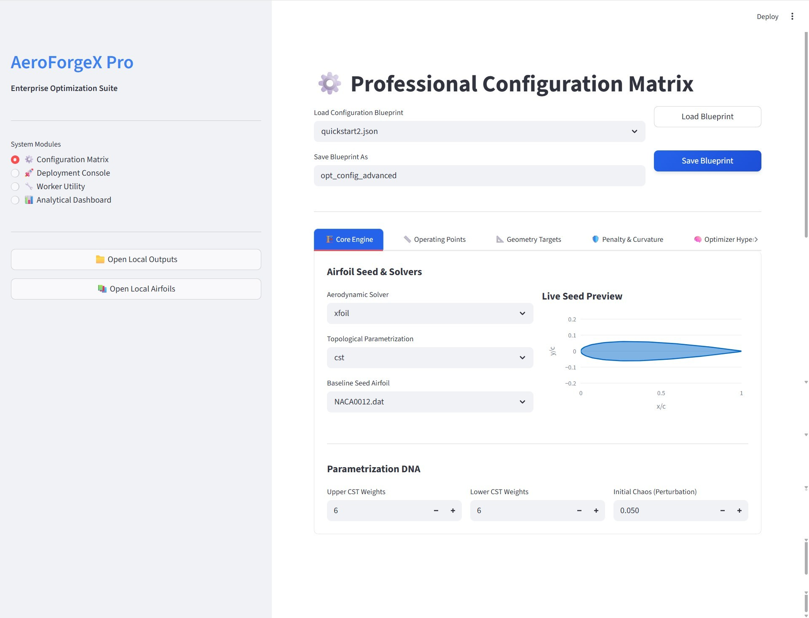
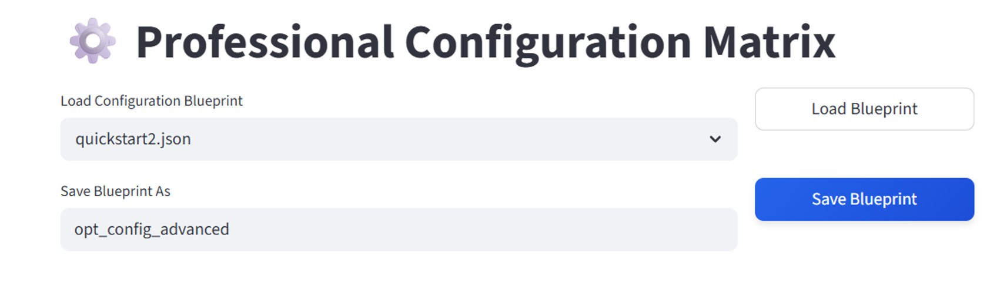
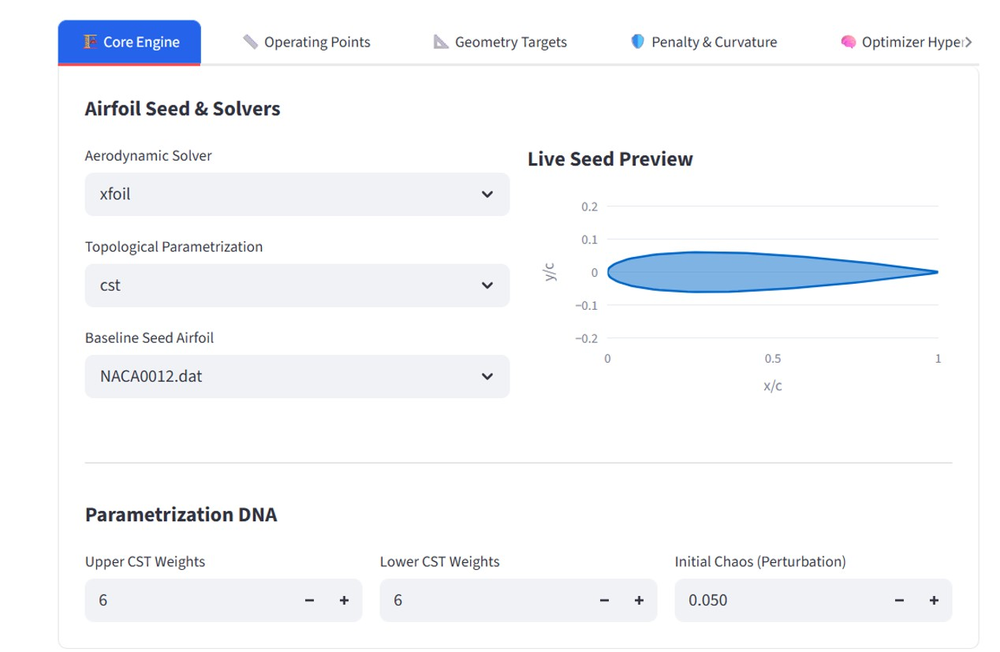
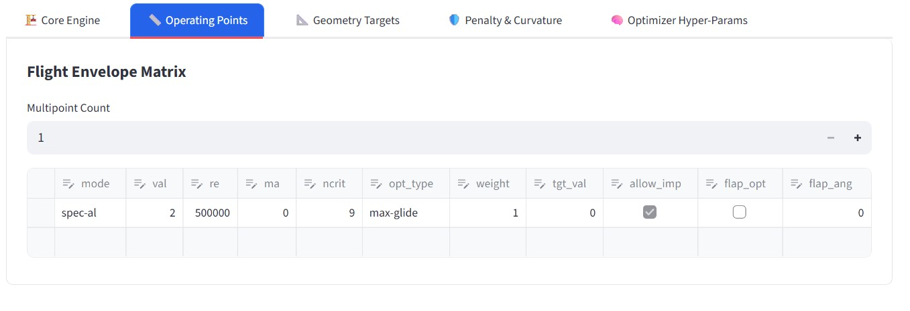
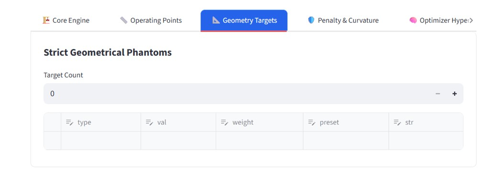
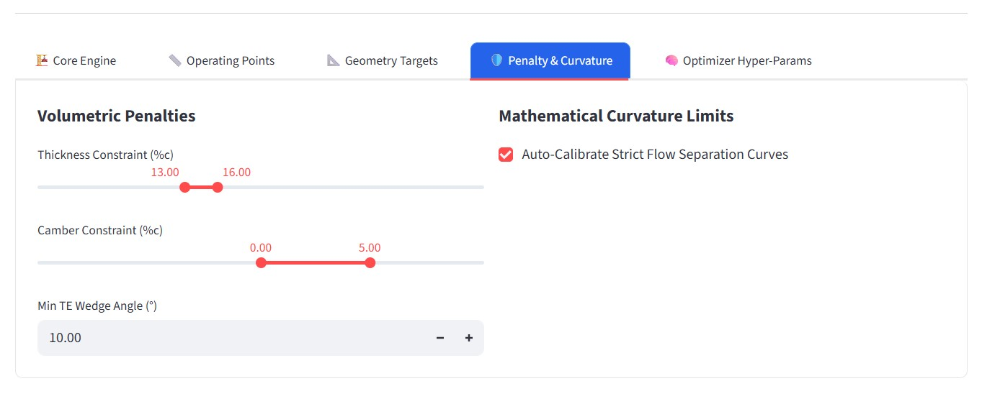
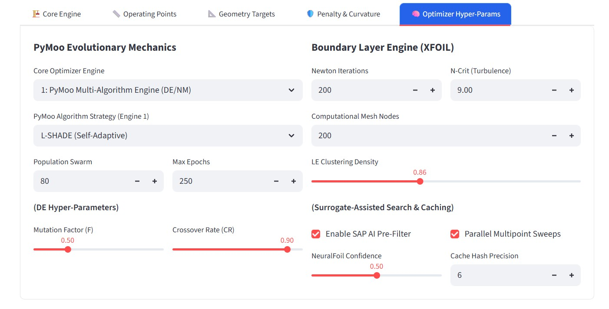
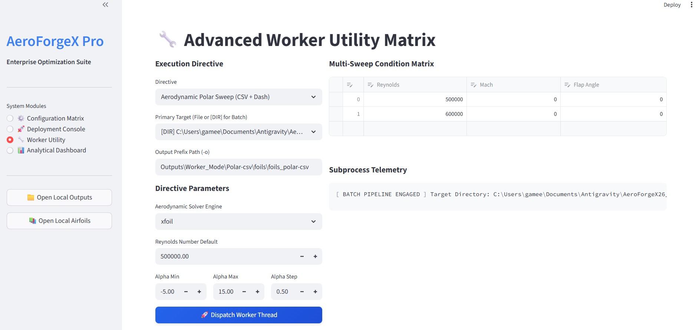
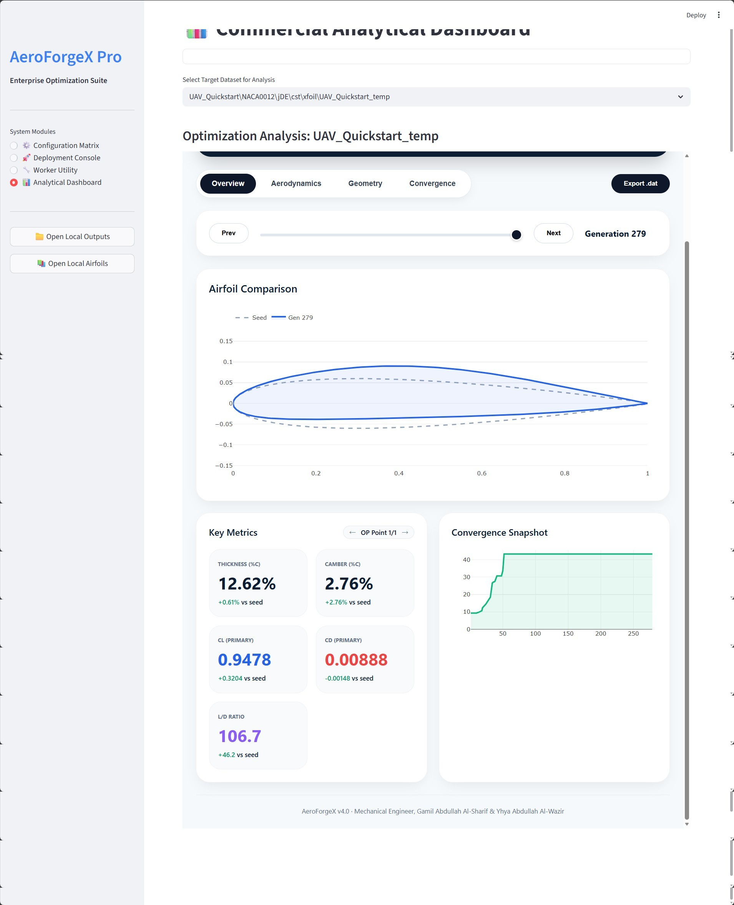
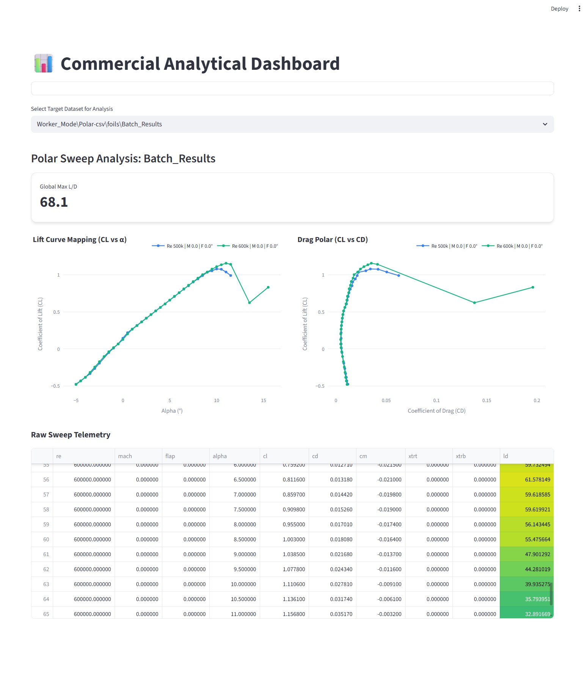

***

<link rel="stylesheet" href="https://cdnjs.cloudflare.com/ajax/libs/font-awesome/6.4.0/css/all.min.css">

## <span style="color: #00BFFF;"><i class="fa-solid fa-globe"></i> SECTION 3: The AeroForgeX Pro Web Ecosystem (GUI)</span>

<!-- FLEXBOX BADGES (GUI Tech Stack) -->
<div style="display: flex; gap: 12px; margin-top: 10px; margin-bottom: 25px; flex-wrap: wrap;">
  
  
  
</div>


### <span style="color: #4682B4;"><i class="fa-solid fa-lightbulb"></i> 3.1 The Paradigm Shift: Visual Aerospace Engineering</span>

Historically, advanced Multidisciplinary Design Optimization (MDO) frameworks were strictly headless command-line applications. While CLI execution is optimal for automated server clusters, it severely hampers rapid prototyping. Engineers were forced to edit complex JSON arrays manually, guess what their parametric constraints looked like, and wait hours before seeing visual results.

**AeroForgeX v4.0 introduces the Pro Web Ecosystem.** Powered by the Streamlit framework and Plotly.js, this is a state-of-the-art, 4-tab interactive web application that runs locally on your workstation. It provides immediate visual feedback, dynamic data grids, and live optimization telemetry without requiring a cloud connection.

<p align="center">
  
</p>


#### <span style="color: #1E90FF; font-weight: bold;"><i class="fa-solid fa-rocket"></i> 3.1.1 The Intelligent Bootstrapper</span>
You do not need to memorize complex local-server hosting commands. The ecosystem features a Python context-hijacker. To launch the dashboard, simply run standard Python:

```bash
streamlit run AeroForgeX_GUI.py
```

<div style="background-color: #F0F4F8; border-left: 4px solid #708090; padding: 12px; border-radius: 4px; color: #333; margin-top: 10px; margin-bottom: 20px;">
  <strong><i class="fa-solid fa-microchip" style="color: #4682B4;"></i> Under the Hood:</strong> The script uses function to detect if it is being run natively or via a web server. If it detects native execution, it intercepts <code>sys.argv</code>, sets a hidden environment variable, and automatically spawns a <code>subprocess</code> to execute <code>streamlit run</code>. Your default web browser will instantly open to <code>http://localhost:8501</code>. <em>Welcome to the Forge.</em>
</div>

---

### <span style="color: #4682B4;"><i class="fa-solid fa-sliders"></i> 3.2 Tab 1: ⚙️ The Configuration Matrix</span>

The Configuration Matrix entirely replaces the need to manually code JSON files. It allows you to visually construct the "DNA" of the Artificial Intelligence, instantly generating and saving valid `.json` blueprints to your `json_Input/` folder.

#### <span style="color: #1E90FF; font-weight: bold;"><i class="fa-solid fa-floppy-disk"></i> 3.2.1 The Blueprint Loader & Saver</span>
*   <span style="color: #2E8B57; font-weight: bold;">Load Blueprint:</span> Scans the `json_Input/` directory. Selecting a blueprint instantly populates all sliders, dropdowns, and data grids by updating the Streamlit `st.session_state`.
*   <span style="color: #2E8B57; font-weight: bold;">Save Blueprint:</span> Synchronizes the visual UI data into a massive Python dictionary and dumps it as a cleanly formatted JSON file, ready for the backend parser.

<p align="center">
  
</p>


#### <span style="color: #1E90FF; font-weight: bold;"><i class="fa-solid fa-industry"></i> 3.2.2 Sub-Tab A: 🏗️ Core Engine</span>
*   **Aerodynamic Solver (`xfoil` vs `neuralfoil`):** Use the AI Surrogate for rapid conceptual exploration, and Fortran for final physical validation.
*   **Topological Parametrization:** Select the mathematical sculptor (`cst`, `bezier`, `hicks-henne`, `camb-thick`).
*   **The Live Seed Preview (Plotly Integration):** A massive quality-of-life upgrade. When a seed is selected, the GUI silently parses the coordinate file and renders a Plotly chart.
    *   *<i class="fa-solid fa-magnifying-glass-chart" style="color: #888;"></i> Mechanics:* The GUI explicitly applies `scaleanchor="x"` and `scaleratio=1` to the Plotly Y-axis. This ensures the airfoil is rendered in an exact 1:1 physical aspect ratio, preventing visual stretching and allowing you to instantly verify true structural thickness.

<p align="center">
  
</p>


#### <span style="color: #1E90FF; font-weight: bold;"><i class="fa-solid fa-ruler-combined"></i> 3.2.3 Sub-Tab B: 📏 Operating Points (Flight Envelope)</span>
Instead of deeply nested JSON arrays, AeroForgeX uses a **Dynamic Pandas DataFrame Spreadsheet**.
*   **Multipoint Count:** If you increase this number from 1 to 3, the GUI automatically appends two new rows to the Pandas DataFrame, prepopulating them with intelligent aerodynamic defaults (e.g., $Re=500k$, Mach=0.0).
*   **The Data Editor Matrix:** Type directly into the cells: `mode` (`spec-al` or `spec-cl`), `val` (target degrees), `opt_type` (objective), and `flap_opt` (active control surfaces).

<p align="center">
  
</p>


#### <span style="color: #1E90FF; font-weight: bold;"><i class="fa-solid fa-compass-drafting"></i> 3.2.4 Sub-Tab C: 📐 Geometry Targets (Soft Constraints)</span>
Uses a dynamic Pandas DataFrame to configure **Soft Constraints**. If your structural team demands the wing be exactly 15% thick, you add a row: `type`: `thickness` | `val`: `0.15` | `weight`: `10.0` *(High weight forces the AI to prioritize structure over aerodynamics).*

<p align="center">
  
</p>


#### <span style="color: #1E90FF; font-weight: bold;"><i class="fa-solid fa-shield-halved"></i> 3.2.5 Sub-Tab D: 🛡️ Penalty & Curvature (The Death Penalty)</span>
Configures the "Topological Bouncer," protecting the fluid solver from crashes.
*   **Volumetric Penalties:** Interactive dual-sliders that define absolute minimum and maximum allowable thickness/camber bounds.
*   **Auto-Calibrate Strict Flow Separation Curves:** A critical checkbox. If enabled, the backend uses Numba calculus to measure the baseline airfoil's natural surface noise and automatically forbids the AI from generating jagged spikes.

<p align="center">
  
</p>


---

#### <span style="color: #1E90FF; font-weight: bold;"><i class="fa-solid fa-brain"></i> 3.2.6 Sub-Tab E: 🧠 Optimizer Hyper-Params (The Deep Dive)</span>

This tab acts as the mission control for the Memetic Artificial Intelligence. The settings here dictate how the AI "thinks," how aggressively it explores mathematical hyperspace, and how strictly it evaluates physics.

<p align="center">
  
</p>


<div style="display: flex; flex-direction: column; gap: 15px; margin-top: 15px; margin-bottom: 25px;">

<!-- Core Optimizer Engine -->
<div style="background-color: #F8F9FA; border: 1px solid #E2E8F0; padding: 15px; border-radius: 6px;">
  <h4 style="margin-top: 0px; margin-bottom: 12px; color: #475569;"><i class="fa-solid fa-dna"></i> 1. Core Optimizer Engine (<code>type</code>)</h4>
  <ul style="margin-bottom: 0px; padding-left: 20px; font-size: 0.95em; color: #444; line-height: 1.6;">
    <li><span style="color: #3B82F6; font-weight: bold;">1 = Standard Differential Evolution (DE):</span> The base framework, natively powered by the PyMoo optimization engine. The traditional "sledgehammer" with fixed mutation rates.</li>
    <li><span style="color: #3B82F6; font-weight: bold;">2 = Custom jDE:</span> The Self-Adaptive Differential Evolution framework. The "Daily Driver". Encodes mutation factors directly into the DNA of the airfoils. The algorithm learns which step sizes yield the best aerodynamics. </li>
    <li><span style="color: #3B82F6; font-weight: bold;">3 = Custom SHADE:</span> The Success-History Adaptive Differential Evolution framework. The "Surgical Scalpel". Maintains a historical archive of successful mathematical leaps using statistical distributions (Cauchy/Normal). <em>An absolute necessity for highly complex problems (12+ variables, High-Order ).</li>
  </ul>
</div>

<!-- PyMoo Strategy -->
<div style="background-color: #F8F9FA; border: 1px solid #E2E8F0; padding: 15px; border-radius: 6px;">
  <h4 style="margin-top: 0px; margin-bottom: 12px; color: #475569;"><i class="fa-solid fa-chess-knight"></i> 2. PyMoo Strategy (<code>algo</code>)</h4>
  <p style="margin-top: 0px; margin-bottom: 12px; font-size: 0.9em; color: #64748B;">Dictates the specific genetic mutation strategy. Choose based on your dimensional complexity:</p>
  
  <ul style="margin-bottom: 0px; padding-left: 20px; font-size: 0.95em; color: #444; line-height: 1.7;">
    
    <li><strong style="color: #8B5CF6;">"de" (Standard DE):</strong> <span style="background-color: #E2E8F0; padding: 2px 6px; border-radius: 4px; font-size: 0.8em; color: #334155; margin-left: 5px;">Requires Type: 1</span><br> 
    Uses fixed, unyielding mutation and crossover rates. Best for simple, low-dimensional problems like Camb-Thick scaling. Struggles heavily with coupled variables like CST due to its fixed step sizes.</li>    <li><strong style="color: #8B5CF6;">"jde" (Self-Adaptive DE):</strong> <span style="background-color: #E2E8F0; padding: 2px 6px; border-radius: 4px; font-size: 0.8em; color: #334155; margin-left: 5px;">Requires Type: 1</span><br> 
    The safest "Daily Driver." Encodes mutation factors directly into the DNA of the airfoils. The algorithm literally learns which step sizes yield the best aerodynamics and shrinks its search radius as it approaches the optimum.</li>  <li><strong style="color: #8B5CF6;">"shade" (Success-History Adaptive):</strong> <span style="background-color: #E2E8F0; padding: 2px 6px; border-radius: 4px; font-size: 0.8em; color: #334155; margin-left: 5px;">Requires Type: 1</span><br> 
    The "Surgical Scalpel." Maintains a historical archive of successful mathematical leaps and uses Cauchy/Normal statistical distributions to generate new parameters. Pulls mutations toward the top 20% of the swarm. <em><strong>Absolute necessity for 12+ variables</strong> (e.g., High-Order Kulfan CST or Kinematic Flap co-optimization).</em></li>  <li><strong style="color: #8B5CF6;">"lshade" (Linear Pop. Reduction):</strong> <span style="background-color: #E2E8F0; padding: 2px 6px; border-radius: 4px; font-size: 0.8em; color: #334155; margin-left: 5px;">Mapped via PyMoo</span><br> 
    As the optimizer nears the final generations, it dynamically shrinks the population size, violently forcing the algorithm from broad global exploration into aggressive local exploitation.</li>  <li><strong style="color: #8B5CF6;">"nm-only" (Nelder-Mead Only):</strong> <span style="background-color: #E2E8F0; padding: 2px 6px; border-radius: 4px; font-size: 0.8em; color: #334155; margin-left: 5px;">Requires Type: 1</span><br> 
    Skips biological evolution entirely. <em>Use this if you have a 99% perfect airfoil and just want gradient-free local polishing to squeeze out the final $10^{-8}$ decimal points of drag.</em></li>
    
  </ul>
</div>
<!-- Population Swarm -->
<div style="background-color: #FFFBEB; border-left: 4px solid #F59E0B; padding: 15px; border-radius: 6px; color: #92400E;">
  <h4 style="margin-top: 0px; color: #B45309;"><i class="fa-solid fa-users"></i> 3. Population Swarm & Epochs</h4>
  <strong>The Golden Rule:</strong> Set your population to at least <strong>$10 \times$ the number of Design Variables</strong>. (e.g., A 12-weight CST shape = 120 population). However, due to AeroForgeX's highly efficient Memetic algorithms, a population of <code>30</code> to <code>50</code> is usually sufficient for standard aerospace tasks. Total evaluations = <code>Population</code> $\times$ <code>Epochs</code>.
</div>

<!-- XFOIL Physics -->
<div style="background-color: #F0FDF4; border-left: 4px solid #10B981; padding: 15px; border-radius: 6px; color: #065F46;">
  <h4 style="margin-top: 0px; color: #047857;"><i class="fa-solid fa-water"></i> 3. Boundary Layer Engine (XFOIL Physics)</h4>
  <ul style="margin-bottom: 0px; padding-left: 20px;">
    <li><strong>Mesh Nodes (<code>npt=161</code>):</strong> Industry standard. <em>Pro-Tip:</em> For High-Order CST (e.g., 9 Top / 9 Bottom), increase this to <code>250</code> to ensure XFOIL captures localized "micro-curve" pressure gradients.</li>
    <li><strong>Newton Iterations (<code>iter=100</code>):</strong> Timeout limit. <em>Pro-Tip:</em> If optimizing near stall or massively thick turbine roots, the fluid dynamics are highly unstable. Increase to <code>200</code> or <code>300</code> to prevent premature timeout errors.</li>
  </ul>
</div>

<!-- Surrogate Assisted Search -->
<div style="background-color: #FEF2F2; border-left: 4px solid #EF4444; padding: 15px; border-radius: 6px; color: #991B1B;">
  <h4 style="margin-top: 0px; color: #B91C1C;"><i class="fa-solid fa-bolt"></i> 5. Surrogate-Assisted Search (SAP) </h4>
  <p style="margin-bottom: 8px; font-size: 0.95em;">The most revolutionary performance upgrade in v4.0. Acts as the ultimate aerodynamic filter, slashing optimization times by up to <strong>80%</strong>.</p>
  <ul style="margin-bottom: 0px; padding-left: 20px; font-size: 0.95em;">
    <li><strong>Enable SAP AI Pre-Filter:</strong> Wakes up the NeuralFoil CNN <em>before</em> sending a shape to Fortran. If the CNN (evaluating in 5ms) predicts catastrophic drag, the shape is instantly killed. <strong>XFOIL is never booted up for bad airfoils.</strong></li>
    <li><strong>NeuralFoil Confidence (0.1 to 0.9):</strong> Deep Learning models suffer from "Out of Distribution" (OOD) hallucinations. If the Bayesian Uncertainty falls below this threshold, AeroForgeX rejects the AI's data, preventing the swarm from being tricked by fake physics.</li>
    <li><strong>Cache Hash Precision:</strong> Evolutionary algorithms often generate mathematically identical airfoils. A precision of <code>6</code> means if an airfoil is identical up to the 6th decimal, the software bypasses XFOIL entirely, instantly retrieving Lift/Drag results from RAM.</li>
  </ul>
</div>

</div>

---

### <span style="color: #4682B4;"><i class="fa-solid fa-terminal"></i> 3.3 Tab 2: 🚀 The Deployment Console</span>

The Deployment Console is where human intent is handed over to the machine.

<p align="center">
  
</p>


#### <span style="color: #1E90FF; font-weight: bold;"><i class="fa-solid fa-code-branch"></i> 3.3.1 Asynchronous Background Threading</span>
A standard web app freezes when executing a heavy task. To prevent OS timeouts during a multi-hour run, the GUI calls to dump the JSON, and spawns a detached `threading.Thread(target=run, daemon=True)`. This thread imports the CLI orchestrator and initiates the PyMoo/Multiprocessing routines completely in the background.

#### <span style="color: #1E90FF; font-weight: bold;"><i class="fa-solid fa-tower-broadcast"></i> 3.3.2 Live Subprocess Telemetry (The StreamLogger)</span>
AeroForgeX uses a custom `StreamLogger` class to hijack the native `sys.stdout` stream and redirect all `print()` statements to `live_log.txt`. 
The `streamlit_autorefresh` component silently reloads the web page every 3 seconds, rendering the bottom 10,000 characters of the log inside a sleek `st.code` block. **Result:** A live, high-performance terminal window rendered directly inside your web browser.

#### <span style="color: #1E90FF; font-weight: bold;"><i class="fa-regular fa-hand"></i> 3.3.3 The Safe-Halt Mechanism</span>
Clicking **⏹ Halt Execution** does not violently kill the thread (which corrupts data). Instead, it creates a blank file named `run_control` with the word `STOP`. The PyMoo callback engine checks this file every generation, gracefully terminating the swarm and compiling final reports before exiting cleanly.

---


<link rel="stylesheet" href="https://cdnjs.cloudflare.com/ajax/libs/font-awesome/6.4.0/css/all.min.css">


### <span style="color: #4682B4;"><i class="fa-solid fa-screwdriver-wrench"></i> 3.4 Tab 3: 🔧 The Dynamic Worker Utility</span>

#### <span style="color: #1E90FF; font-weight: bold;"><i class="fa-solid fa-wand-magic-sparkles"></i> 3.4.1 Introduction to the Visual Toolkit</span>
While the Memetic Optimization Engine (Tab 1 & 2) serves as the autonomous AI "Brain" of AeroForgeX, **Tab 3: The Dynamic Worker Utility** serves as the manual, high-precision "Swiss Army Knife."

Historically, executing single-shot mathematical actions (like blending two airfoils or generating a Drag Polar) required engineers to open a terminal window, remember complex command-line arguments, and manually type paths like `-w blend 50 -a Airfoils/Foil1.dat -a2 Airfoils/Foil2.dat`.

The Streamlit Web Ecosystem eliminates this friction. Tab 3 provides a **Reactive User Interface**. As you select different aerodynamic actions from a dropdown menu, the GUI instantly morphs—hiding irrelevant settings and dynamically rendering exactly the sliders, text boxes, solver dropdowns, and data grids required for that specific mathematical operation.

<p align="center">
  
</p>


#### <span style="color: #1E90FF; font-weight: bold;"><i class="fa-solid fa-columns"></i> 3.4.2 The Anatomy of the Interface</span>
The Worker Utility interface is split into two distinct columns:
1.  <span style="color: #3CB371; font-weight: bold;">The Left Column (Execution Directive & Parameters):</span> Your control panel. Here you define the *Action*, the *Target Airfoil*, the *Solver Engine*, and the specific mathematical *Parameters*.
2.  <span style="color: #8A2BE2; font-weight: bold;">The Right Column (Telemetry & Matrices):</span> Adapts based on your action. If running an Aerodynamic Sweep, it displays a dynamic Pandas spreadsheet. Once a task is dispatched, it acts as a live terminal window streaming the Fortran/Numba console output directly to your browser.

---

<div style="background: linear-gradient(135deg, #1E293B 0%, #0F172A 100%); border: 1px solid #38BDF8; padding: 20px; border-radius: 8px; color: #F8FAFC; margin-top: 20px; margin-bottom: 25px; box-shadow: 0 4px 15px rgba(14, 165, 233, 0.2);">
  <h3 style="margin-top: 0px; color: #38BDF8; text-transform: uppercase; letter-spacing: 1px;"><i class="fa-solid fa-bolt-lightning" style="color: #FCD34D;"></i> 3.4.3 Target Selection & The Batch Pipeline Interceptor</h3>
  <p style="font-size: 0.95em; line-height: 1.6; margin-bottom: 15px;">Before selecting an action, you must define the target. The GUI automatically scans your local <code>Airfoils/</code> directory to populate the <strong>"Primary Target"</strong> dropdown. It also dynamically generates a <strong>Smart Output Prefix Path</strong> (e.g., <code>Outputs/Worker_Mode/Polar-csv/NACA0012/</code>) to guarantee perfect file organization without manually typing paths.</p>
  
  <h4 style="margin-top: 0px; margin-bottom: 8px; color: #60A5FA;">The <code>[DIR]</code> Tag (Massive Automation)</h4>
  <p style="font-size: 0.9em; line-height: 1.5; margin-bottom: 10px; color: #CBD5E1;">AeroForgeX v4.0 introduces the GUI-driven Batch Pipeline Interceptor. When the UI scans your folder, it looks for sub-folders as well as files. If it finds a folder, it adds it to the dropdown with a <code>[DIR]</code> prefix (e.g., <code>[DIR] UIUC_Database</code>).</p>
  
  <ul style="color: #CBD5E1; font-size: 0.9em; margin-bottom: 10px; padding-left: 20px;">
    <li><strong style="color: #F8FAFC;">What it does:</strong> If you select a <code>[DIR]</code> target, the GUI commands the backend to map <em>every single airfoil</em> inside that folder. When you click Dispatch, AeroForgeX queries your OS for your CPU core count and unleashes a massive multiprocessing pool, executing your chosen action on hundreds of airfoils simultaneously.</li>
    <li><strong style="color: #F8FAFC;">The Pollution-Free Output:</strong> The GUI automatically isolates the batch data. It routes the output strictly to a dedicated <code>Outputs/Batch_Run/Batch_Results/</code> directory, cleanly depositing the processed files without polluting your raw <code>Airfoils/</code> database folders.</li>
  </ul>
</div>

---

#### <span style="color: #1E90FF; font-weight: bold;"><i class="fa-solid fa-microchip"></i> 3.4.4 The Execution Directives (Exhaustive Breakdown)</span>
When you select an action from the **"Directive"** dropdown, the UI executes internal `if/elif` logic to render specific input fields. Here is the exact breakdown:

<div style="display: flex; flex-direction: column; gap: 15px; margin-top: 15px;">

<!-- 1. Polar Sweeps -->
<div style="background-color: #F8F9FA; border-left: 4px solid #1E90FF; padding: 15px; border-radius: 4px;">
  <h4 style="margin-top: 0px; color: #333;"><i class="fa-solid fa-wind" style="color: #4682B4;"></i> 1. Aerodynamic Polar Sweeps (<code>polar</code> & <code>polar-csv</code>)</h4>
  <p style="font-size: 0.9em; margin-bottom: 8px;"><em>Automates XFOIL/NeuralFoil to evaluate the airfoil across a massive combinatorial matrix of flight conditions.</em></p>
  <ul style="font-size: 0.9em; margin-bottom: 0px; padding-left: 20px; color: #555;">
    <li><strong>Aerodynamic Solver Engine: <span style="color: #E63946;"></span></strong> A reactive dropdown allowing you to explicitly route the sweep through the traditional <code>xfoil</code> Fortran binary or the lightning-fast <code>neuralfoil</code> AI surrogate.</li>
    <li><strong>Reynolds Number Default:</strong> Numeric input (Default: <code>500,000.0</code>, stepping by <code>50,000.0</code>).</li>
    <li><strong>Alpha Sweep Bounds:</strong> Three side-by-side numeric inputs for <strong>Min</strong> (<code>-5.0</code>), <strong>Max</strong> (<code>15.0</code>), and <strong>Step</strong> (<code>0.5</code>).</li>
    <li><strong>Multi-Sweep Condition Matrix:</strong> The right column transforms into an interactive Pandas <code>st.data_editor</code>. Exposes columns for <em>Reynolds</em>, <em>Mach</em>, and <em>Flap Angle</em>. Add rows to define multiple flight envelopes (e.g., Row 1: Re 500k; Row 2: Re 1M).</li>
  </ul>
  <div style="background-color: #E6F2FF; padding: 8px; border-radius: 4px; margin-top: 10px; font-size: 0.85em; color: #004085;">
    <i class="fa-solid fa-gears"></i> <strong>Under the Hood:</strong> The GUI extracts the arrays from Pandas, injects them alongside your Solver Selection into a <code>_worker_polar_cfg.json</code> payload, and routes them to the backend. (<code>polar-csv</code> also triggers the automated HTML Polar Dashboard).
  </div>
</div>

<!-- 2. Kinematic Flap -->
<div style="background-color: #F8F9FA; border-left: 4px solid #FF8C00; padding: 15px; border-radius: 4px;">
  <h4 style="margin-top: 0px; color: #333;"><i class="fa-solid fa-plane-tail" style="color: #DAA520;"></i> 2. Kinematic Trailing Edge Deflection (<code>flap</code>)</h4>
  <p style="font-size: 0.9em; margin-bottom: 8px;"><em>Physically rotates the trailing edge of the coordinate array to simulate deployed ailerons or control surfaces.</em></p>
  <ul style="font-size: 0.9em; margin-bottom: 0px; padding-left: 20px; color: #555;">
    <li><strong>Aerodynamic Solver Engine: <span style="color: #E63946;"></span></strong> Select <code>xfoil</code> or <code>neuralfoil</code> to handle the rotation mathematics.</li>
    <li><strong>Hinge X:</strong> Numeric input (0.0 to 1.0) defining chordwise location (Default: <code>0.75</code>).</li>
    <li><strong>Hinge Y:</strong> Numeric input defining vertical hinge location (Default: <code>0.0</code>).</li>
    <li><strong>Deflect °:</strong> Numeric input (-45.0 to 45.0). Positive = drop TE down (camber); Negative = deflect up (reflex).</li>
  </ul>
</div>

<!-- 3. Foil Blending -->
<div style="background-color: #F8F9FA; border-left: 4px solid #8A2BE2; padding: 15px; border-radius: 4px;">
  <h4 style="margin-top: 0px; color: #333;"><i class="fa-solid fa-object-group" style="color: #9370DB;"></i> 3. Algorithmic Foil Blending (<code>blend</code>)</h4>
  <p style="font-size: 0.9em; margin-bottom: 8px;"><em>Mathematically interpolates two distinct shapes (e.g., thick root and thin tip) to create a transitional lofting station.</em></p>
  <ul style="font-size: 0.9em; margin-bottom: 0px; padding-left: 20px; color: #555;">
    <li><strong>Secondary Airfoil Matrix (<code>-a2</code>):</strong> A second dropdown to select the target foil from your directory.</li>
    <li><strong>Morphing Ratio Slider:</strong> Scale from <code>0.0</code> to <code>1.0</code>. (Setting <code>0.25</code> creates a shape that is 75% Primary Foil, 25% Secondary).</li>
  </ul>
</div>

<!-- 4. Bezier Match -->
<div style="background-color: #F8F9FA; border-left: 4px solid #32CD32; padding: 15px; border-radius: 4px;">
  <h4 style="margin-top: 0px; color: #333;"><i class="fa-solid fa-bezier-curve" style="color: #2E8B57;"></i> 4. Topological Simplex Match (<code>bezier</code>)</h4>
  <p style="font-size: 0.9em; margin-bottom: 8px;"><em>Salvages jagged, noise-corrupted wind tunnel data by using a Nelder-Mead algorithm to "shrink-wrap" a perfectly smooth analytical polynomial over raw coordinates.</em></p>
  <ul style="font-size: 0.9em; margin-bottom: 0px; padding-left: 20px; color: #555;">
    <li><strong>Top/Bottom Control Polynomials:</strong> Sliders (2 to 20) dictating how many Bezier weights the solver uses on each surface.</li>
  </ul>
</div>

<!-- 5. Mutation & Generation -->
<div style="background-color: #F8F9FA; border-left: 4px solid #DC143C; padding: 15px; border-radius: 4px;">
  <h4 style="margin-top: 0px; color: #333;"><i class="fa-solid fa-layer-group" style="color: #B22222;"></i> 5. Hard Scalar Mutation (<code>set</code>) & Generation (<code>generate</code>)</h4>
  <ul style="font-size: 0.9em; margin-bottom: 0px; padding-left: 20px; color: #555;">
    <li><strong><code>set</code>:</strong> Forces a global affine transformation to scale physical volume instantly. (Select Thickness, Camber, etc., and input a hard Percentage).</li>
    <li><strong><code>generate</code>:</strong> Auto-generates an entire suite of airfoils scaled incrementally. (Provides Min %, Max %, and Step counts).</li>
  </ul>
</div>

<!-- 6. Filtering & Normalization -->
<div style="background-color: #F8F9FA; border-left: 4px solid #20B2AA; padding: 15px; border-radius: 4px;">
  <h4 style="margin-top: 0px; color: #333;"><i class="fa-solid fa-broom" style="color: #008B8B;"></i> 6. Smoothing Filter (<code>smooth</code>) & Normalization (<code>norm</code>)</h4>
  <ul style="font-size: 0.9em; margin-bottom: 0px; padding-left: 20px; color: #555;">
    <li><strong><code>smooth</code>:</strong> Applies a Savitzky-Golay signal filter to strip static/noise. (Exposes Window Size slider).</li>
    <li><strong><code>norm</code>:</strong> Translates, rotates, and repanels the mesh to perfectly align with a $0.0 \rightarrow 1.0$ bounding box using NASA Arc-Cosine clustering. (Exposes Repanel Nodes input).</li>
  </ul>
</div>

</div>

---

#### <span style="color: #1E90FF; font-weight: bold;"><i class="fa-solid fa-server"></i> 3.4.5 The Dispatch Mechanism (Preventing Browser Freezes)</span>
Once configured, you click **🚀 Dispatch Worker Thread**. If the GUI executed standard Python functions, the browser tab would freeze until the math completed (a 3-Reynolds polar sweep could take 10 minutes, causing a catastrophic OS timeout crash).

**AeroForgeX uses a deeply integrated Asynchronous Dispatcher:**
1.  **JSON Payload Assembly:** Silently extracts your system settings and overrides them with your Worker Tab UI inputs.
2.  **State Freezing & Organization <span style="color: #E63946;"></span>:** Dumps the payload into a strictly organized temporary file: `json_Input/Worker_Mode/<airfoil>_<action>_cfg.json`, keeping your root configuration folders flawlessly clean.
3.  **Safe Directory Creation <span style="color: #E63946;"></span>:** Automatically evaluates the target Output Prefix and uses `os.makedirs(exist_ok=True)` to build out any missing deeply-nested directories on your hard drive before execution, completely eliminating `FileNotFoundError` crashes.
4.  **Namespace Forging:** Generates a mock `argparse.Namespace` object, simulating a terminal command.
5.  **The Daemon Thread:** Spawns a background `threading.Thread(target=run_worker_task, daemon=True)`. This thread detaches from the UI, imports `aeroforgex_cli.py`, and begins heavy computation.
6.  **Stream Hijacking:** Maps `sys.stdout` to a physical `StreamLogger` object, writing every terminal print statement to `Outputs/live_log.txt`. 

#### <span style="color: #1E90FF; font-weight: bold;"><i class="fa-solid fa-satellite-dish"></i> 3.4.6 Subprocess Telemetry</span>
Because work is dispatched to a background thread, the GUI must provide feedback.
*   The right-hand column features a **Subprocess Telemetry** window utilizing `st.code(language="bash")`.
*   Because Streamlit is reactive, every time the page refreshes, it reads the last 10,000 characters of `live_log.txt`.
*   **The Result:** You see the exact Numba calculus outputs, XFOIL boundary layer warnings, and batch-processing progress bars scrolling live inside your browser window.

---

### <span style="color: #4682B4;"><i class="fa-solid fa-chart-pie"></i> 3.5 Tab 4: 📊 The Commercial Analytical Dashboard</span>

Generating thousands of data points is useless if you cannot interpret them. This dashboard reads raw `.csv` ledgers and generates interactive Plotly graphics natively in the browser.

#### <span style="color: #1E90FF; font-weight: bold;"><i class="fa-solid fa-folder-tree"></i> 3.5.1 The Directory Scanner</span>
The GUI recursively scans your `Outputs/` directory for any optimization ledgers (`Design_Coordinates.csv`) or worker sweep ledgers (`polar_master.csv`). It maps absolute paths, sorts them by OS Modified Time, and presents them in a dropdown menu.

#### <span style="color: #1E90FF; font-weight: bold;"><i class="fa-solid fa-chart-area"></i> 3.5.2 Mode A: Embedded Optimization Analysis</span>
*   The GUI injects the massive Plotly Javascript dashboard (`[Prefix]_Interactive_Report.html`) directly into an iframe.
*   **The Fallback Plotter:** If the run is still active, the GUI engages a Fallback Convergence Plotter, reading the `_Conv.csv` ledger to plot a live, adaptive Plotly graph tracking the $F_{obj}$ Improvement Percentage against the Generation count in real-time.

<p align="center">
  
</p>


#### <span style="color: #1E90FF; font-weight: bold;"><i class="fa-solid fa-wind"></i> 3.5.3 Mode B: Polar Sweep Analysis</span>
If you ran a `polar-csv` sweep, the GUI parses the massive CSV matrix and generates a native aerospace dashboard:
1.  **Automated KPI Extraction:** Calculates $L/D = C_L / C_D$ for every row, extracting the **Global Max L/D** as a massive Streamlit Metric card.
2.  **Multi-Trace Interactive Plotting:** Uses Pandas  to isolate unique flight physics. Generates color-coded Plotly traces for the **Lift Curve** and **Drag Polar**. Hover over curves to read exact drag values at stall angles.
3.  **Raw Telemetry Rendering:** The raw DataFrame is rendered using `st.dataframe`, color-mapped with a `viridis` gradient to instantly highlight peak aerodynamic efficiency visually.

<p align="center">
  
</p>


***

### <span style="color: #00BFFF;"><i class="fa-solid fa-flag-checkered"></i> 3.6 Conclusion to the Web Ecosystem</span>

The AeroForgeX GUI is not merely a wrapper; it is an **industrial command center**. By leveraging asynchronous threading, reactive state management, and embedded Plotly integration, it transforms a highly complex array of Fortran physics engines and AI tensors into an accessible, visually stunning daily engineering tool.
