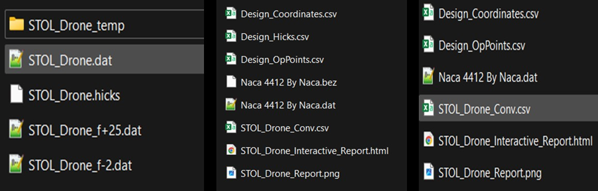
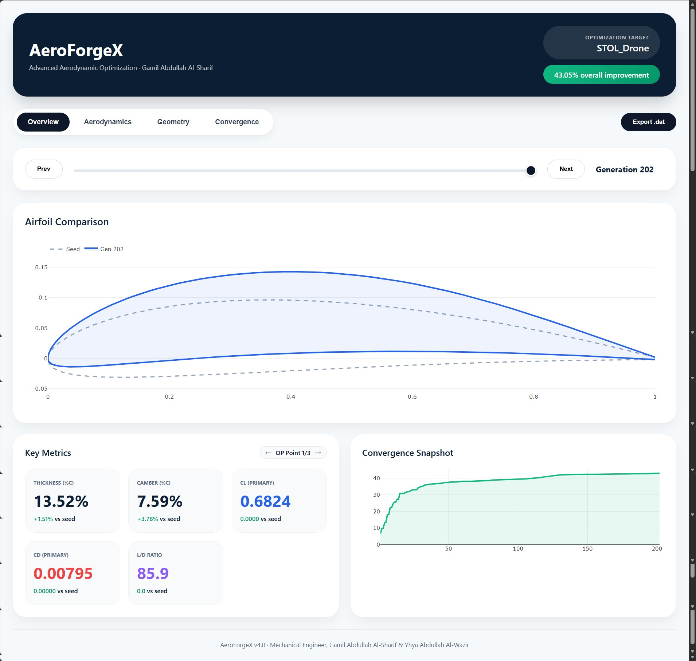
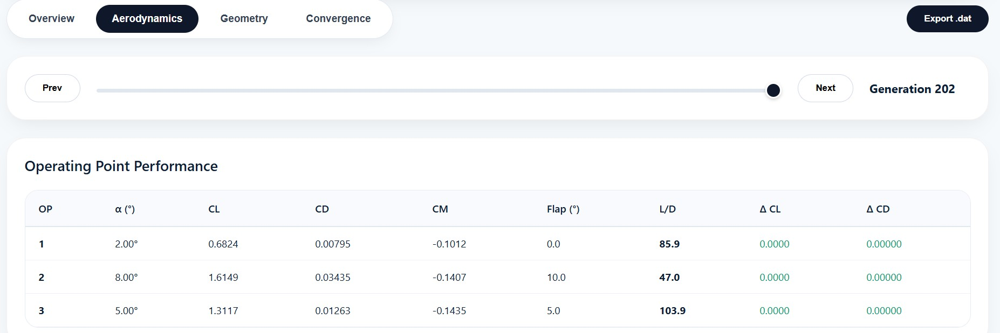
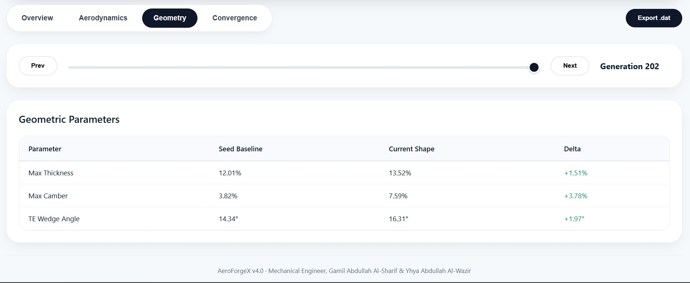
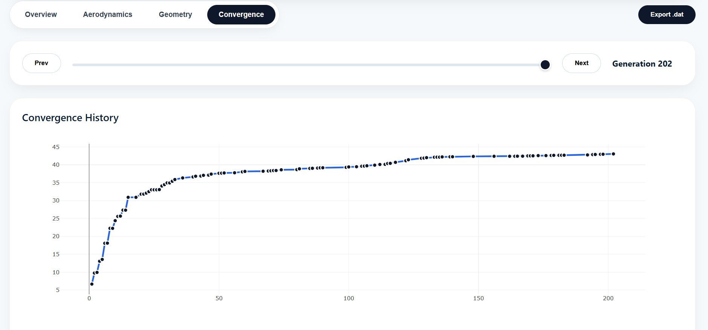
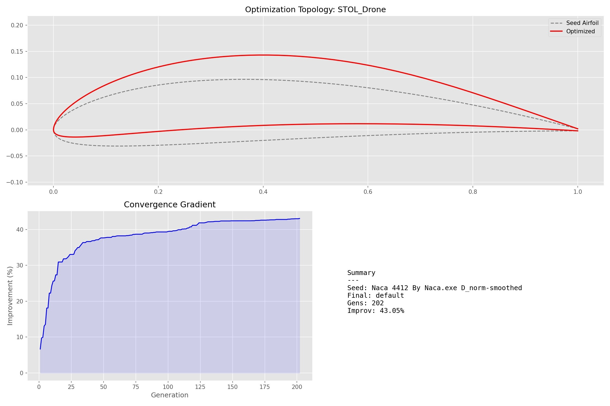

***

<link rel="stylesheet" href="https://cdnjs.cloudflare.com/ajax/libs/font-awesome/6.4.0/css/all.min.css">

## <i class="fa-solid fa-chart-pie"></i> SECTION 9: Data Outputs & Interactive Dashboards

<!-- FLEXBOX BADGES (Perfectly Spaced & Formatted) -->

  
  
  
  

### <i class="fa-solid fa-eye"></i> 9.1 The Philosophy of Visual Engineering

In computational aerodynamics, generating data is only half the battle; interpreting that data is where true engineering occurs. A standard 50-generation Memetic optimization run across 3 operating points generates a matrix of over 15,000 distinct floating-point values.

Staring at a scrolling terminal of ASCII numbers makes it impossible to identify holistic trends, such as whether an optimizer is trading too much pitching moment for a marginal gain in lift.

  <h4 style="margin-top: 0px; margin-bottom: 8px; color: #065F46;"><i class="fa-solid fa-lightbulb"></i> The AeroForgeX Solution</h4>
  
AeroForgeX v4.0 abandons legacy text-based plotting in favor of <strong>Standalone Interactive HTML Dashboards</strong>. By serializing massive NumPy arrays into embedded JSON objects, it injects optimization data directly into HTML templates powered by <strong>Plotly.js</strong>. The resulting <code>.html</code> files are 100% offline, highly portable, and render at 60 FPS in any modern web browser, bringing aerospace-grade visualization to your desktop without requiring an active Python server.

---

### <i class="fa-solid fa-folder-tree"></i> 9.2 File System Architecture (Data Collision)

When evaluating hundreds of parametric combinations, data collision (accidentally overwriting a previous run's data) is a major risk. AeroForgeX utilizes an automated directory nesting system to ensure every run is safely sandboxed.

If `"auto_output_dir": true` is enabled in your JSON, the system automatically generates:

  <code style="color: #3B82F1; font-size: 0.95em;">Outputs / [Prefix] / [Seed_Airfoil] / [Algorithm] / [Shape_Function] / [Solver] /</code>

*Example:* Running `Project_Alpha.json` on `NACA0012.dat` using SHADE, CST, and XFOIL outputs precisely to: `Outputs/Project_Alpha/NACA0012/SHADE/cst/xfoil/`

---

### <i class="fa-solid fa-box-open"></i> 9.3 The Deliverables (Inside the Sandbox)

Within this deepest folder, AeroForgeX deposits the following files upon completion:

  

  <ul style="margin-bottom: 0px; padding-left: 20px; font-size: 0.95em; color: #444; line-height: 1.7;">
    <li><strong style="color: #1E3A8A;"><code>[Prefix].dat</code>:</strong> The final, absolute optimal geometry in Selig format. <strong>CFD/CAD-ready.</strong></li>
    <li><strong style="color: #1E3A8A;"><code>[Prefix]-norm.dat</code>:</strong> Your original input Seed, mathematically "sanitized" (rotated to 0,0 and clustered via Arc-Cosine). <em>(⚠️ If running CFD comparisons, use THIS as the baseline to ensure identical mesh resolution).</em></li>
    <li><strong style="color: #1E3A8A;"><code>[Prefix]_f[Angle].dat</code>:</strong> The actively deflected optimal airfoil (if Kinematic Flaps were used).</li>
    <li><strong style="color: #1E3A8A;"><code>[Prefix].bez</code> / <code>.hicks</code>:</strong> The exact mathematical blueprint variables used by the AI.</li>
    <li><strong style="color: #1E3A8A;"><code>[Prefix]_Report.png</code>:</strong> The Visual Executive Report graphic.</li>
    <li><strong style="color: #1E3A8A;"><code>Design_*.csv</code>:</strong> The "Black Box" flight recorder spreadsheets.</li>
    <li><strong style="color: #D97706;"><code>[Prefix]_Interactive_Report.html</code>:</strong> The crown jewel; the Plotly convergence dashboard.</li>
  </ul>

---

### <i class="fa-solid fa-clock-rotate-left"></i> 9.4 Dashboard 1: Memetic Convergence (The Time Machine)

When a 50-generation algorithm completes, simply looking at the final shape tells you nothing about *how* the AI solved the problem. This interactive dashboard acts as a "Time Machine."

  

  <!-- Slider Card -->
  

    <h4 style="margin-top: 0px; margin-bottom: 10px; color: #475569;"><i class="fa-solid fa-sliders" style="color: #3B82F6;"></i> 9.4.1 Generational Slider & Dynamic DOM Manipulation</h4>
    
At the top of the HTML page sits a slider. When dragged, a JavaScript event listener reads the embedded JSON object and utilizes <code>Plotly.react()</code> to instantly overwrite DOM elements via WebGL, allowing for buttery-smooth animations of the airfoil morphing without page refreshes.

  

  <!-- Tab 1 Card -->
  

    <h4 style="margin-top: 0px; margin-bottom: 10px; color: #475569;"><i class="fa-solid fa-layer-group" style="color: #10B981;"></i> 9.4.2 Tab 1: The Overview Interface</h4>
    
<strong>The Morphing Plot:</strong> Displays the Seed Airfoil (dashed line) overlaid with the current generation (solid polygon). Watch the AI pull down the leading edge or thicken the spar in real-time.

    
<strong>The KPI Delta Grid:</strong> Calculates the $\Delta$ (Delta) against the Seed. If $C_D$ drops, text turns <strong style="color: #059669;">Green</strong>. If $C_L$ drops to achieve it, it turns <strong style="color: #DC2626;">Red</strong>. Instantly assess AI compromises.

  

  

  

  <!-- Tab 2 & 3 Card -->
  

    <h4 style="margin-top: 0px; margin-bottom: 10px; color: #475569;"><i class="fa-solid fa-table" style="color: #F59E0B;"></i> 9.4.3 Multi-Point & Constraint Tracking (Tabs 2 & 3)</h4>
    
Tab 2 generates dynamic tables showing performance across <em>all</em> requested operating points simultaneously, vital for detecting "Objective Collapse."

    
Tab 3 tracks structural integrity. Watch the AI thin an airfoil to reduce drag, hit your 12% mathematical "wall," and slide perfectly along it without violating the constraint.

  

  

  <!-- Tab 4 Card -->
  

    <h4 style="margin-top: 0px; margin-bottom: 10px; color: #92400E;"><i class="fa-solid fa-chart-line"></i> 9.4.4 Diagnosing Stagnation (Tab 4: Global Curve)</h4>
    
Plots Objective Improvement over time. If the line spikes by Gen 5 and flatlines for 45 generations, the optimization "stagnated" in a local minimum. <em>Solution: Increase population, switch to SHADE, or loosen constraints to open the hyperspace.</em>

  

---

### <i class="fa-solid fa-file-export"></i> 9.5 Data Extraction & CAD Integration

While visualizing data is excellent, eventually, the airfoil must be manufactured.

  <h4 style="margin-top: 0px; margin-bottom: 10px; color: #475569;"><i class="fa-brands fa-js" style="color: #F7DF1E;"></i> The "Export .dat" JavaScript Engine</h4>
  
Imagine you slide to Gen 50 but notice the camber is too aggressive for manufacturing. You slide back to Gen 32 and find a safer shape that is 98% as efficient. How do you extract it?

  <ol style="margin-bottom: 0px; padding-left: 20px; font-size: 0.9em; color: #555; line-height: 1.7;">
    <li>Click the blue <strong>"Export .dat"</strong> button in the dashboard.</li>
    <li>A JS function extracts the $X/Y$ arrays of the <em>currently selected generation</em> from the JSON.</li>
    <li>It utilizes the HTML5 <code>Blob</code> API to generate a virtual file in browser memory.</li>
    <li>It triggers a fake <code>&lt;a href="download"&gt;</code> click.</li>
    <li><code>AeroForgeX_Gen_32.dat</code> instantly downloads, ready for SolidWorks or ANSYS!</li>
  </ol>

---

### <i class="fa-solid fa-database"></i> 9.6 Raw Data Logs (The "Black Box" CSVs)

For engineers building ML models or using tools like Tableau, AeroForgeX logs every microsecond of the optimization into Pandas-compatible CSV files.

  <!-- OpPoints Card -->
  

    <h4 style="margin-top: 0px; margin-bottom: 10px; color: #475569;"><i class="fa-solid fa-wind" style="color: #3B82F6;"></i> 9.6.1 <code>Design_OpPoints.csv</code></h4>
    
Tracks the aerodynamic physics ($C_L, C_D, X_{tr}$) of every generation.

    

      <strong><i class="fa-solid fa-magnifying-glass"></i> Auditing Dynamic Weighting:</strong> If you scroll the <code>weight</code> column and suddenly see numbers skyrocket (e.g., 2.0 to 8.5), you are witnessing the "Extra Punch." The AI realized it was failing a target and automatically inflated the penalty multiplier mid-run to force swarm correction.
    

  

  <!-- Coordinates Card -->
  

    <h4 style="margin-top: 0px; margin-bottom: 10px; color: #475569;"><i class="fa-solid fa-draw-polygon" style="color: #10B981;"></i> 9.6.2 <code>Design_Coordinates.csv</code></h4>
    
Power outages are a real threat to 10-hour HPC runs. This file writes the physical $(X, Y)$ arrays to disk the exact second a better airfoil is discovered. If your PC crashes at Gen 199/200, the optimal shape is safely stored.

    

      <strong>⚠️ Multiprocessing Warning:</strong> Because Core 5 might finish Gen 349 slightly before Core 2 finishes a stalled Gen 348, CSV rows might be out of numerical order. Always verify the <code>No</code> column.
    

  

  <!-- GeoTargets Card -->
  

    <h4 style="margin-top: 0px; margin-bottom: 10px; color: #475569;"><i class="fa-solid fa-ruler" style="color: #F59E0B;"></i> 9.6.3 <code>Design_GeoTargets.csv</code></h4>
    
If you requested Soft-Targets (e.g., exact 15% thickness), this spreadsheet tracks the <code>val</code> (actual dimension), <code>dev</code> (percentage error from your goal), and the <code>weight</code> priority scalar applied by the AI.

  

---

### <i class="fa-solid fa-image"></i> 9.7 The Visual Executive Report (<code>[Prefix]_Report.png</code>)

To provide immediate, human-readable proof of the optimization's success, AeroForgeX uses `matplotlib` to render a high-resolution PNG graphic the exact second the run concludes, designed to be dropped directly into engineering presentations.

  

  <ul style="margin-bottom: 0px; padding-left: 20px; font-size: 0.95em; color: #444; line-height: 1.7;">
    <li><strong style="color: #1E3A8A;">1. Top Graph (Optimization Topology):</strong> A physical overlay. The Seed is a dashed gray line, the Optimized Airfoil is a solid red line. Instantly visually verify the AI's physical strategy (e.g., <em>"It thickened the forward spar and reflexed the tail."</em>)</li>
    <li><strong style="color: #1E3A8A;">2. Bottom-Left Graph (Convergence Gradient):</strong> Charts learning progress. A healthy run shows a steep climb during Stage 1 Evolution, followed by a long, slow plateau as the Simplex polishes decimals to absolute perfection.</li>
    <li><strong style="color: #1E3A8A;">3. Bottom-Right Text (Mathematical Summary):</strong> A clean data block logging core parameters and the final validated Improvement Percentage.</li>
  </ul>

